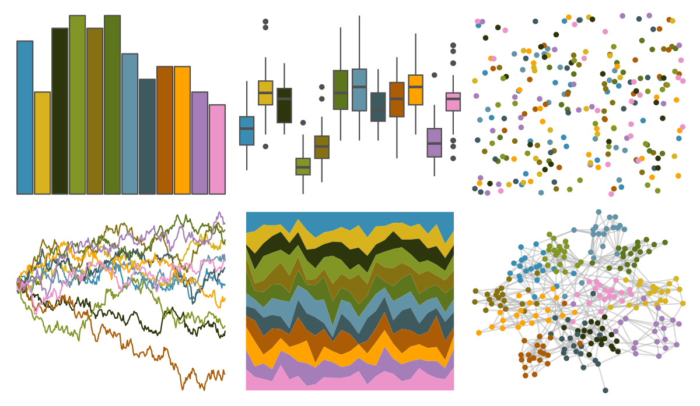

# PrettyCols - Summer 

::: columns
::: {.column width="50%"}

**Github**

[nrennie/PrettyCols](https://github.com/nrennie/PrettyCols)
:::

::: {.column width="50%"}

**CRAN**

[PrettyCols](https://CRAN.R-project.org/package=PrettyCols)
:::
:::

<hr> 

Use with [paletteer](https://emilhvitfeldt.github.io/paletteer/) package:

```r
library(paletteer)
paletteer_d("PrettyCols::Summer")
```

Use raw:

```r
c("#808FBBFF", "#E0A662FF", "#785B57FF", "#AC9567FF", "#AE7F5BFF", "#968262FF", "#9993B5FF", "#837189FF", "#C57253FF", "#F79D50FF", "#C086BFFF", "#EC94CAFF")
``` 

 

<br>

# Related Palettes

<div class="list" style="display: grid; grid-template-columns: auto auto auto;"> <figure class="figure">
<a href="../../amerika/Dem_Ind_Rep3/"> </a>
</figure> <figure class="figure">
<a href="../../MetBrewer/Morgenstern/"> </a>
</figure> <figure class="figure">
<a href="../../ggthemes/Winter/"> </a>
</figure> <figure class="figure">
<a href="../../palettetown/seaking/"> </a>
</figure> <figure class="figure">
<a href="../../trekcolors/lcars_first_contact/"> </a>
</figure> <figure class="figure">
<a href="../../Redmonder/dPBIPuOr/"> </a>
</figure> <figure class="figure">
<a href="../../ggthemes/Classic_Color_Blind/"> </a>
</figure> <figure class="figure">
<a href="../../ggthemes/Color_Blind/"> </a>
</figure> <figure class="figure">
<a href="../../NatParksPalettes/BryceCanyon/"> </a>
</figure> <figure class="figure">
<a href="../../tvthemes/Day/"> </a>
</figure> <figure class="figure">
<a href="../../ochRe/namatjira_div/"> </a>
</figure> <figure class="figure">
<a href="../../PNWColors/Sunset/"> </a>
</figure> 
</div>
