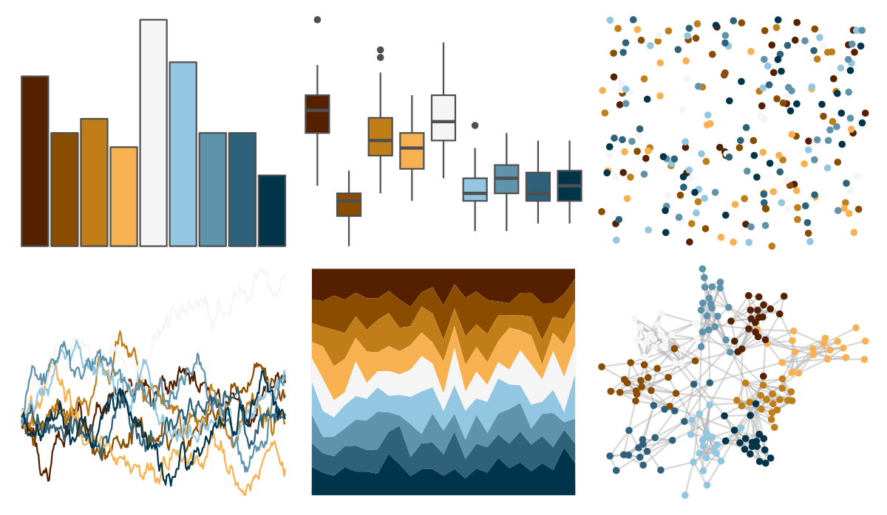

# PrettyCols - TangerineBlues 

::: columns
::: {.column width="50%"}

**Github**

[nrennie/PrettyCols](https://github.com/nrennie/PrettyCols)
:::

::: {.column width="50%"}

**CRAN**

[PrettyCols](https://CRAN.R-project.org/package=PrettyCols)
:::
:::

<hr> 

Use with [paletteer](https://emilhvitfeldt.github.io/paletteer/) package:

```r
library(paletteer)
paletteer_d("PrettyCols::TangerineBlues")
```

Use raw:

```r
c("#552000FF", "#8A4D00FF", "#C17D17FF", "#F8B150FF", "#F5F5F5FF", "#93C6E1FF", "#5F93ACFF", "#2E627AFF", "#00344AFF")
``` 

 

<br>

# Related Palettes

<div class="list" style="display: grid; grid-template-columns: auto auto auto;"> <figure class="figure">
<a href="../../awtools/a_palette/"> </a>
</figure> <figure class="figure">
<a href="../../ButterflyColors/hamadryas_feronia/"> </a>
</figure> <figure class="figure">
<a href="../../ButterflyColors/hamadryas_feronia/"> </a>
</figure> <figure class="figure">
<a href="../../Redmonder/qMSOAsp/"> </a>
</figure> <figure class="figure">
<a href="../../palettetown/totodile/"> </a>
</figure> <figure class="figure">
<a href="../../nationalparkcolors/GeneralGrant/"> </a>
</figure> <figure class="figure">
<a href="../../werpals/uyuni/"> </a>
</figure> <figure class="figure">
<a href="../../MexBrewer/Revolucion/"> </a>
</figure> <figure class="figure">
<a href="../../nationalparkcolors/BlueRidgePkwy/"> </a>
</figure> <figure class="figure">
<a href="../../miscpalettes/dreaming/"> </a>
</figure> <figure class="figure">
<a href="../../palettetown/chinchou/"> </a>
</figure> <figure class="figure">
<a href="../../dutchmasters/milkmaid/"> </a>
</figure> 
</div>
