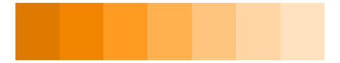
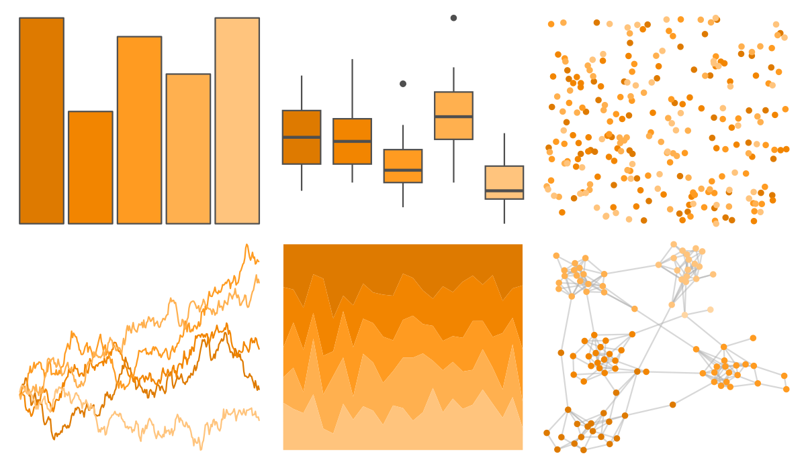

# PrettyCols - Tangerines 

::: columns
::: {.column width="50%"}

**Github**

[nrennie/PrettyCols](https://github.com/nrennie/PrettyCols)
:::

::: {.column width="50%"}

**CRAN**

[PrettyCols](https://CRAN.R-project.org/package=PrettyCols)
:::
:::

<hr> 

Use with [paletteer](https://emilhvitfeldt.github.io/paletteer/) package:

```r
library(paletteer)
paletteer_d("PrettyCols::Tangerines")
```

Use raw:

```r
c("#DE7A00FF", "#F28500FF", "#FF9B21FF", "#FFB04FFF", "#FFC47DFF", "#FFD6A3FF", "#FFE1BDFF")
``` 

 

<br>

# Related Palettes

<div class="list" style="display: grid; grid-template-columns: auto auto auto;"> <figure class="figure">
<a href="../../amerika/Dem_Ind_Rep3/"> </a>
</figure> <figure class="figure">
<a href="../../ggsci/orange_material/"> </a>
</figure> <figure class="figure">
<a href="../../ggsci/amber_material/"> </a>
</figure> <figure class="figure">
<a href="../../fishualize/Cephalopholis_fulva/"> </a>
</figure> <figure class="figure">
<a href="../../fishualize/Chormis_multilineata/"> </a>
</figure> <figure class="figure">
<a href="../../calecopal/canary/"> </a>
</figure> <figure class="figure">
<a href="../../ggprism/flames/"> </a>
</figure> <figure class="figure">
<a href="../../ggsci/yellow_material/"> </a>
</figure> <figure class="figure">
<a href="../../rcartocolor/Peach/"> </a>
</figure> <figure class="figure">
<a href="../../fishualize/Holocentrus_adscensionis/"> </a>
</figure> <figure class="figure">
<a href="../../RColorBrewer/Oranges/"> </a>
</figure> <figure class="figure">
<a href="../../calecopal/eschscholzia/"> </a>
</figure> 
</div>
