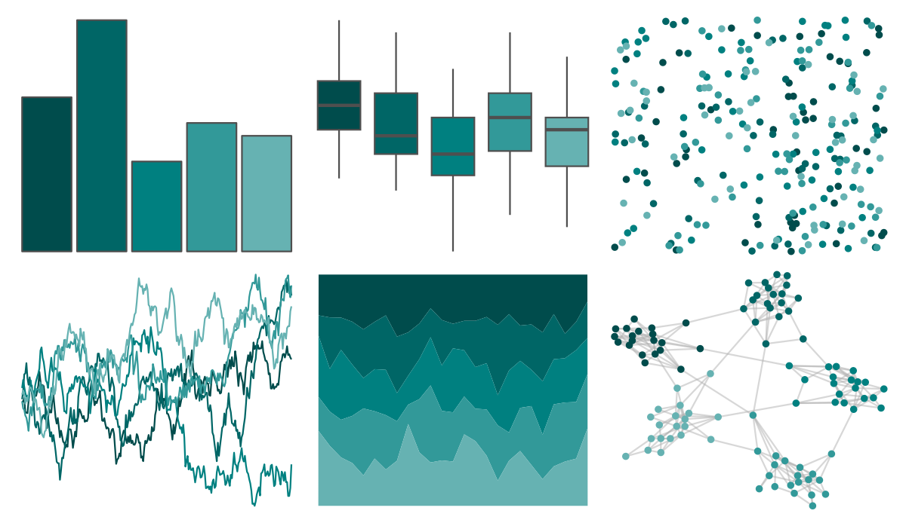

# PrettyCols - Teals 

::: columns
::: {.column width="50%"}

**Github**

[nrennie/PrettyCols](https://github.com/nrennie/PrettyCols)
:::

::: {.column width="50%"}

**CRAN**

[PrettyCols](https://CRAN.R-project.org/package=PrettyCols)
:::
:::

<hr> 

Use with [paletteer](https://emilhvitfeldt.github.io/paletteer/) package:

```r
library(paletteer)
paletteer_d("PrettyCols::Teals")
```

Use raw:

```r
c("#004C4CFF", "#006666FF", "#008080FF", "#329999FF", "#66B2B2FF", "#99CCCCFF", "#CCE5E5FF")
``` 

 

<br>

# Related Palettes

<div class="list" style="display: grid; grid-template-columns: auto auto auto;"> <figure class="figure">
<a href="../../awtools/a_palette/"> </a>
</figure> <figure class="figure">
<a href="../../ButterflyColors/hamadryas_feronia/"> </a>
</figure> <figure class="figure">
<a href="../../ButterflyColors/hamadryas_feronia/"> </a>
</figure> <figure class="figure">
<a href="../../ggsci/teal_material/"> </a>
</figure> <figure class="figure">
<a href="../../Redmonder/sPBIGn/"> </a>
</figure> <figure class="figure">
<a href="../../rcartocolor/Mint/"> </a>
</figure> <figure class="figure">
<a href="../../rockthemes/coltrane/"> </a>
</figure> <figure class="figure">
<a href="../../RColorBrewer/PuBuGn/"> </a>
</figure> <figure class="figure">
<a href="../../NatParksPalettes/Glacier/"> </a>
</figure> <figure class="figure">
<a href="../../unikn/pal_petrol/"> </a>
</figure> <figure class="figure">
<a href="../../ggsci/cyan_material/"> </a>
</figure> <figure class="figure">
<a href="../../rcartocolor/DarkMint/"> </a>
</figure> 
</div>
