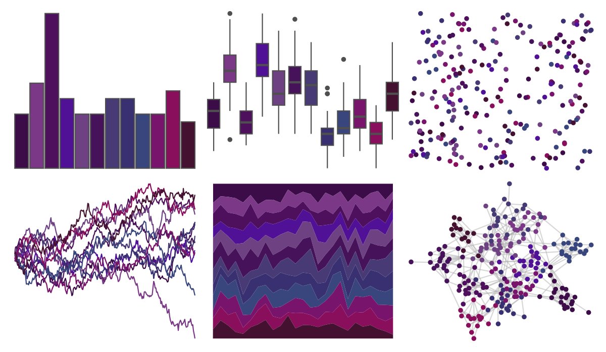

# PrettyCols - Velvet 

::: columns
::: {.column width="50%"}

**Github**

[nrennie/PrettyCols](https://github.com/nrennie/PrettyCols)
:::

::: {.column width="50%"}

**CRAN**

[PrettyCols](https://CRAN.R-project.org/package=PrettyCols)
:::
:::

<hr> 

Use with [paletteer](https://emilhvitfeldt.github.io/paletteer/) package:

```r
library(paletteer)
paletteer_d("PrettyCols::Velvet")
```

Use raw:

```r
c("#3C0C48FF", "#7A3886FF", "#4E105CFF", "#501196FF", "#6E4183FF", "#46135AFF", "#483B75FF", "#383071FF", "#39457DFF", "#78146CFF", "#890E5CFF", "#451130FF")
``` 

 

<br>

# Related Palettes

<div class="list" style="display: grid; grid-template-columns: auto auto auto;"> <figure class="figure">
<a href="../../amerika/Dem_Ind_Rep3/"> </a>
</figure> <figure class="figure">
<a href="../../beyonce/X120/"> </a>
</figure> <figure class="figure">
<a href="../../PrettyCols/Purples/"> </a>
</figure> <figure class="figure">
<a href="../../beyonce/X98/"> </a>
</figure> <figure class="figure">
<a href="../../lisa/Prince/"> </a>
</figure> <figure class="figure">
<a href="../../beyonce/X112/"> </a>
</figure> <figure class="figure">
<a href="../../miscpalettes/berry/"> </a>
</figure> <figure class="figure">
<a href="../../ButterflyColors/chorinea_licursis/"> </a>
</figure> <figure class="figure">
<a href="../../beyonce/X31/"> </a>
</figure> <figure class="figure">
<a href="../../beyonce/X91/"> </a>
</figure> <figure class="figure">
<a href="../../poisonfrogs/Dtazureus/"> </a>
</figure> <figure class="figure">
<a href="../../ghibli/KikiDark/"> </a>
</figure> 
</div>
