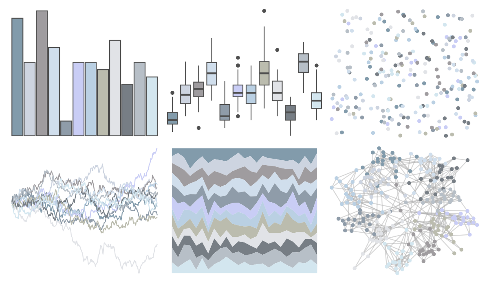

# PrettyCols - Winter 

::: columns
::: {.column width="50%"}

**Github**

[nrennie/PrettyCols](https://github.com/nrennie/PrettyCols)
:::

::: {.column width="50%"}

**CRAN**

[PrettyCols](https://CRAN.R-project.org/package=PrettyCols)
:::
:::

<hr> 

Use with [paletteer](https://emilhvitfeldt.github.io/paletteer/) package:

```r
library(paletteer)
paletteer_d("PrettyCols::Winter")
```

Use raw:

```r
c("#829BABFF", "#CDD4E0FF", "#9F9C9FFF", "#D0DEECFF", "#8F9CA9FF", "#C9CDF5FF", "#BAD0E3FF", "#BBBCAEFF", "#E1E3E7FF", "#777E85FF", "#B7BFC7FF", "#D3E6EFFF")
``` 

 

<br>

# Related Palettes

<div class="list" style="display: grid; grid-template-columns: auto auto auto;"> <figure class="figure">
<a href="../../amerika/Dem_Ind_Rep3/"> </a>
</figure> <figure class="figure">
<a href="../../ghibli/SpiritedLight/"> </a>
</figure> <figure class="figure">
<a href="../../ghibli/LaputaLight/"> </a>
</figure> <figure class="figure">
<a href="../../nord/afternoon_prarie/"> </a>
</figure> <figure class="figure">
<a href="../../ghibli/YesterdayLight/"> </a>
</figure> <figure class="figure">
<a href="../../IslamicArt/samarqand/"> </a>
</figure> <figure class="figure">
<a href="../../palettetown/dewgong/"> </a>
</figure> <figure class="figure">
<a href="../../ghibli/KikiLight/"> </a>
</figure> <figure class="figure">
<a href="../../ghibli/TotoroLight/"> </a>
</figure> <figure class="figure">
<a href="../../Redmonder/sPBIBu/"> </a>
</figure> <figure class="figure">
<a href="../../ghibli/MarnieLight1/"> </a>
</figure> <figure class="figure">
<a href="../../IslamicArt/istanbul/"> </a>
</figure> 
</div>
