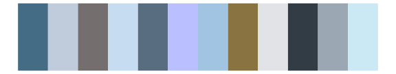
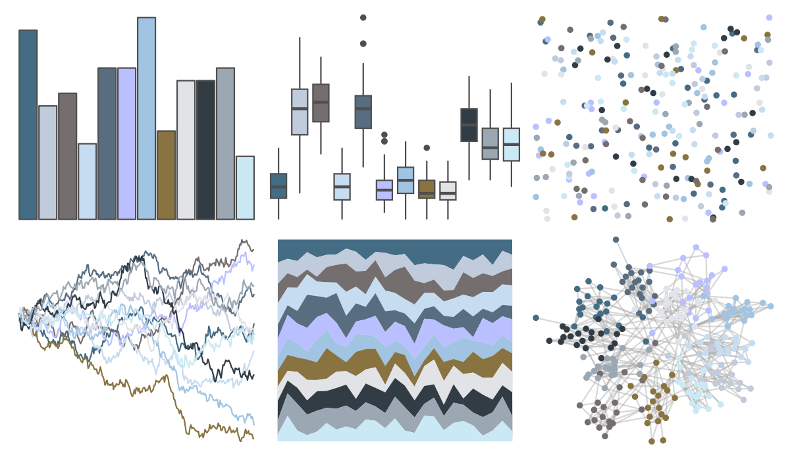

# PrettyCols - Winter 

::: columns
::: {.column width="50%"}

**Github**

[nrennie/PrettyCols](https://github.com/nrennie/PrettyCols)
:::

::: {.column width="50%"}

**CRAN**

[PrettyCols](https://CRAN.R-project.org/package=PrettyCols)
:::
:::

<hr> 

Use with [paletteer](https://emilhvitfeldt.github.io/paletteer/) package:

```r
library(paletteer)
paletteer_d("PrettyCols::Winter")
```

Use raw:

```r
c("#446C84FF", "#C0CBDCFF", "#746E6FFF", "#C6DCF0FF", "#596D80FF", "#B9BFFFFF", "#A0C4E1FF", "#897340FF", "#E1E3E7FF", "#313C45FF", "#9BA7B2FF", "#CAE9F5FF")
``` 

 

<br>

# Related Palettes

<div class="list" style="display: grid; grid-template-columns: auto auto auto;"> <figure class="figure">
<a href="../../awtools/a_palette/"> </a>
</figure> <figure class="figure">
<a href="../../ButterflyColors/hamadryas_feronia/"> </a>
</figure> <figure class="figure">
<a href="../../ButterflyColors/hamadryas_feronia/"> </a>
</figure> <figure class="figure">
<a href="../../palettetown/glalie/"> </a>
</figure> <figure class="figure">
<a href="../../palettetown/lugia/"> </a>
</figure> <figure class="figure">
<a href="../../palettetown/mantine/"> </a>
</figure> <figure class="figure">
<a href="../../IslamicArt/samarqand/"> </a>
</figure> <figure class="figure">
<a href="../../palettetown/pupitar/"> </a>
</figure> <figure class="figure">
<a href="../../palettetown/metagross/"> </a>
</figure> <figure class="figure">
<a href="../../palettetown/latios/"> </a>
</figure> <figure class="figure">
<a href="../../palettetown/venomoth/"> </a>
</figure> <figure class="figure">
<a href="../../palettetown/dragonair/"> </a>
</figure> 
</div>
