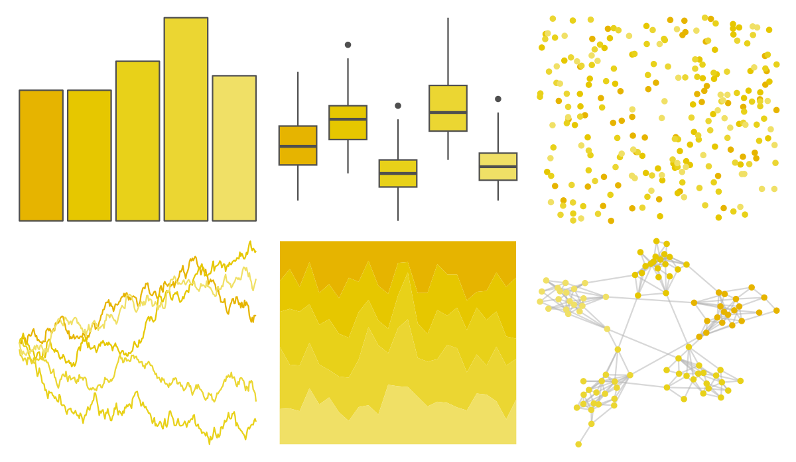
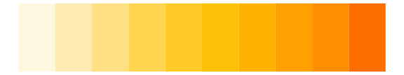

# PrettyCols - Yellows 

::: columns
::: {.column width="50%"}

**Github**

[nrennie/PrettyCols](https://github.com/nrennie/PrettyCols)
:::

::: {.column width="50%"}

**CRAN**

[PrettyCols](https://CRAN.R-project.org/package=PrettyCols)
:::
:::

<hr> 

Use with [paletteer](https://emilhvitfeldt.github.io/paletteer/) package:

```r
library(paletteer)
paletteer_d("PrettyCols::Yellows")
```

Use raw:

```r
c("#E6B400FF", "#E6C700FF", "#E8D119FF", "#EBD632FF", "#F0E066FF", "#F2E57FFF", "#F7EFB2FF")
``` 

 

<br>

# Related Palettes

<div class="list" style="display: grid; grid-template-columns: auto auto auto;"> <figure class="figure">
<a href="../../awtools/a_palette/"> </a>
</figure> <figure class="figure">
<a href="../../ButterflyColors/hamadryas_feronia/"> </a>
</figure> <figure class="figure">
<a href="../../ButterflyColors/hamadryas_feronia/"> </a>
</figure> <figure class="figure">
<a href="../../fishualize/Prognathodes_brasiliensis/"> </a>
</figure> <figure class="figure">
<a href="../../ggsci/lime_material/"> </a>
</figure> <figure class="figure">
<a href="../../ggsci/yellow_material/"> </a>
</figure> <figure class="figure">
<a href="../../waRhol/skull_76_1/"> </a>
</figure> <figure class="figure">
<a href="../../ggprism/mustard_field/"> </a>
</figure> <figure class="figure">
<a href="../../ggprism/mustard_field2/"> </a>
</figure> <figure class="figure">
<a href="../../ggsci/amber_material/"> </a>
</figure> <figure class="figure">
<a href="../../colRoz/c_kingii/"> </a>
</figure> <figure class="figure">
<a href="../../Redmonder/sPBIYl/"> </a>
</figure> 
</div>
