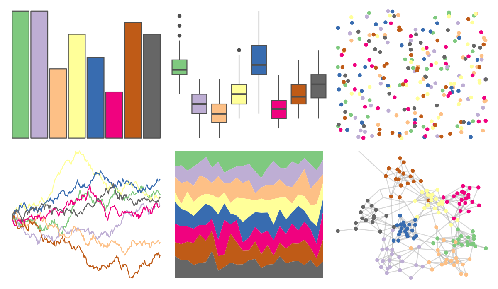

# RColorBrewer - Accent 

::: columns
::: {.column width="50%"}

**Github**

Not on Github
:::

::: {.column width="50%"}

**CRAN**

[RColorBrewer](https://CRAN.R-project.org/package=RColorBrewer)
:::
:::

<hr> 

Use with [paletteer](https://emilhvitfeldt.github.io/paletteer/) package:

```r
library(paletteer)
paletteer_d("RColorBrewer::Accent")
```

Use raw:

```r
c("#7FC97FFF", "#BEAED4FF", "#FDC086FF", "#FFFF99FF", "#386CB0FF", "#F0027FFF", "#BF5B17FF", "#666666FF")
``` 

 

<br>

# Related Palettes

<div class="list" style="display: grid; grid-template-columns: auto auto auto;"> <figure class="figure">
<a href="../../amerika/Dem_Ind_Rep3/"> </a>
</figure> <figure class="figure">
<a href="../../colorblindr/OkabeIto/"> </a>
</figure> <figure class="figure">
<a href="../../ggthemes/few_Medium/"> </a>
</figure> <figure class="figure">
<a href="../../peRReo/calle13/"> </a>
</figure> <figure class="figure">
<a href="../../ggthemr/flat_dark/"> </a>
</figure> <figure class="figure">
<a href="../../awtools/mpalette/"> </a>
</figure> <figure class="figure">
<a href="../../ggsci/observable10_observable/"> </a>
</figure> <figure class="figure">
<a href="../../basetheme/brutal/"> </a>
</figure> <figure class="figure">
<a href="../../RColorBrewer/Dark2/"> </a>
</figure> <figure class="figure">
<a href="../../ggthemes/Tableau_10/"> </a>
</figure> <figure class="figure">
<a href="../../yarrr/xmen/"> </a>
</figure> <figure class="figure">
<a href="../../RColorBrewer/Set1/"> </a>
</figure> 
</div>
