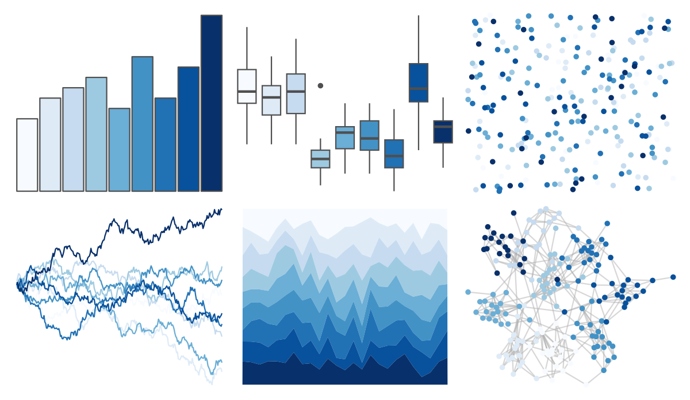

# RColorBrewer - Blues 

::: columns
::: {.column width="50%"}

**Github**

Not on Github
:::

::: {.column width="50%"}

**CRAN**

[RColorBrewer](https://CRAN.R-project.org/package=RColorBrewer)
:::
:::

<hr> 

Use with [paletteer](https://emilhvitfeldt.github.io/paletteer/) package:

```r
library(paletteer)
paletteer_d("RColorBrewer::Blues")
```

Use raw:

```r
c("#F7FBFFFF", "#DEEBF7FF", "#C6DBEFFF", "#9ECAE1FF", "#6BAED6FF", "#4292C6FF", "#2171B5FF", "#08519CFF", "#08306BFF")
``` 

 

<br>

# Related Palettes

<div class="list" style="display: grid; grid-template-columns: auto auto auto;"> <figure class="figure">
<a href="../../awtools/a_palette/"> </a>
</figure> <figure class="figure">
<a href="../../ButterflyColors/hamadryas_feronia/"> </a>
</figure> <figure class="figure">
<a href="../../ButterflyColors/hamadryas_feronia/"> </a>
</figure> <figure class="figure">
<a href="../../grDevices/blues9/"> </a>
</figure> <figure class="figure">
<a href="../../RColorBrewer/PuBu/"> </a>
</figure> <figure class="figure">
<a href="../../RColorBrewer/PuBuGn/"> </a>
</figure> <figure class="figure">
<a href="../../ggsci/blue_material/"> </a>
</figure> <figure class="figure">
<a href="../../beyonce/X43/"> </a>
</figure> <figure class="figure">
<a href="../../LaCroixColoR/Pure/"> </a>
</figure> <figure class="figure">
<a href="../../RColorBrewer/Purples/"> </a>
</figure> <figure class="figure">
<a href="../../RColorBrewer/BuPu/"> </a>
</figure> <figure class="figure">
<a href="../../NatParksPalettes/Glacier/"> </a>
</figure> 
</div>
