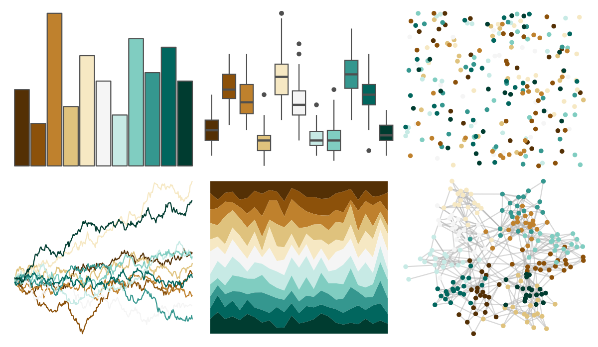
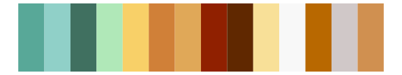

# RColorBrewer - BrBG 

::: columns
::: {.column width="50%"}

**Github**

Not on Github
:::

::: {.column width="50%"}

**CRAN**

[RColorBrewer](https://CRAN.R-project.org/package=RColorBrewer)
:::
:::

<hr> 

Use with [paletteer](https://emilhvitfeldt.github.io/paletteer/) package:

```r
library(paletteer)
paletteer_d("RColorBrewer::BrBG")
```

Use raw:

```r
c("#543005FF", "#8C510AFF", "#BF812DFF", "#DFC27DFF", "#F6E8C3FF", "#F5F5F5FF", "#C7EAE5FF", "#80CDC1FF", "#35978FFF", "#01665EFF", "#003C30FF")
``` 

 

<br>

# Related Palettes

<div class="list" style="display: grid; grid-template-columns: auto auto auto;"> <figure class="figure">
<a href="../../awtools/a_palette/"> </a>
</figure> <figure class="figure">
<a href="../../ButterflyColors/hamadryas_feronia/"> </a>
</figure> <figure class="figure">
<a href="../../ButterflyColors/hamadryas_feronia/"> </a>
</figure> <figure class="figure">
<a href="../../palettetown/squirtle/"> </a>
</figure> <figure class="figure">
<a href="../../ggthemr/carrot/"> </a>
</figure> <figure class="figure">
<a href="../../Redmonder/dPBIRdGn/"> </a>
</figure> <figure class="figure">
<a href="../../palettetown/elekid/"> </a>
</figure> <figure class="figure">
<a href="../../palettetown/rayquaza/"> </a>
</figure> <figure class="figure">
<a href="../../futurevisions/earth/"> </a>
</figure> <figure class="figure">
<a href="../../palettetown/ivysaur/"> </a>
</figure> <figure class="figure">
<a href="../../werpals/mountcook/"> </a>
</figure> <figure class="figure">
<a href="../../palettetown/hitmonlee/"> </a>
</figure> 
</div>
