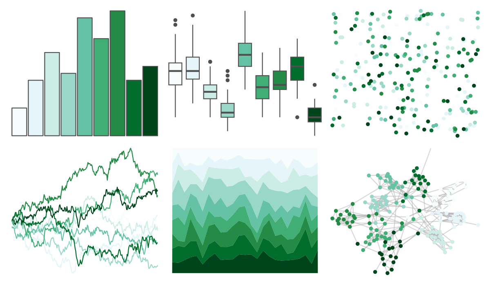

# RColorBrewer - BuGn 

::: columns
::: {.column width="50%"}

**Github**

Not on Github
:::

::: {.column width="50%"}

**CRAN**

[RColorBrewer](https://CRAN.R-project.org/package=RColorBrewer)
:::
:::

<hr> 

Use with [paletteer](https://emilhvitfeldt.github.io/paletteer/) package:

```r
library(paletteer)
paletteer_d("RColorBrewer::BuGn")
```

Use raw:

```r
c("#F7FCFDFF", "#E5F5F9FF", "#CCECE6FF", "#99D8C9FF", "#66C2A4FF", "#41AE76FF", "#238B45FF", "#006D2CFF", "#00441BFF")
``` 

 

<br>

# Related Palettes

<div class="list" style="display: grid; grid-template-columns: auto auto auto;"> <figure class="figure">
<a href="../../awtools/a_palette/"> </a>
</figure> <figure class="figure">
<a href="../../ButterflyColors/hamadryas_feronia/"> </a>
</figure> <figure class="figure">
<a href="../../ButterflyColors/hamadryas_feronia/"> </a>
</figure> <figure class="figure">
<a href="../../ggsci/teal_material/"> </a>
</figure> <figure class="figure">
<a href="../../PNWColors/Lake/"> </a>
</figure> <figure class="figure">
<a href="../../Redmonder/qMSOGnYl/"> </a>
</figure> <figure class="figure">
<a href="../../fishualize/Parablennius_pilicornis/"> </a>
</figure> <figure class="figure">
<a href="../../RColorBrewer/Greens/"> </a>
</figure> <figure class="figure">
<a href="../../nationalparkcolors/Voyageurs/"> </a>
</figure> <figure class="figure">
<a href="../../Redmonder/sPBIGn/"> </a>
</figure> <figure class="figure">
<a href="../../Redmonder/qMSOGn/"> </a>
</figure> <figure class="figure">
<a href="../../tayloRswift/taylorSwift/"> </a>
</figure> 
</div>
