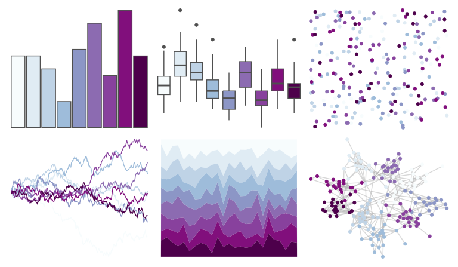

# RColorBrewer - BuPu 

::: columns
::: {.column width="50%"}

**Github**

Not on Github
:::

::: {.column width="50%"}

**CRAN**

[RColorBrewer](https://CRAN.R-project.org/package=RColorBrewer)
:::
:::

<hr> 

Use with [paletteer](https://emilhvitfeldt.github.io/paletteer/) package:

```r
library(paletteer)
paletteer_d("RColorBrewer::BuPu")
```

Use raw:

```r
c("#F7FCFDFF", "#E0ECF4FF", "#BFD3E6FF", "#9EBCDAFF", "#8C96C6FF", "#8C6BB1FF", "#88419DFF", "#810F7CFF", "#4D004BFF")
``` 

 

<br>

# Related Palettes

<div class="list" style="display: grid; grid-template-columns: auto auto auto;"> <figure class="figure">
<a href="../../awtools/a_palette/"> </a>
</figure> <figure class="figure">
<a href="../../RColorBrewer/Purples/"> </a>
</figure> <figure class="figure">
<a href="../../palettetown/wooper/"> </a>
</figure> <figure class="figure">
<a href="../../palettetown/lugia/"> </a>
</figure> <figure class="figure">
<a href="../../palettetown/zubat/"> </a>
</figure> <figure class="figure">
<a href="../../tvthemes/WaterTribe/"> </a>
</figure> <figure class="figure">
<a href="../../RColorBrewer/PuBu/"> </a>
</figure> <figure class="figure">
<a href="../../LaCroixColoR/Berry/"> </a>
</figure> <figure class="figure">
<a href="../../beyonce/X11/"> </a>
</figure> <figure class="figure">
<a href="../../palettetown/dragonair/"> </a>
</figure> <figure class="figure">
<a href="../../Redmonder/qMSOPu2/"> </a>
</figure> <figure class="figure">
<a href="../../grDevices/blues9/"> </a>
</figure> 
</div>
