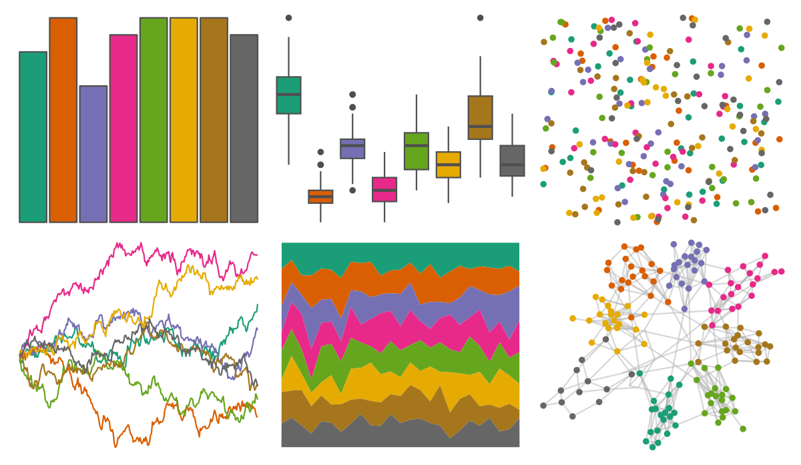

# RColorBrewer - Dark2 

::: columns
::: {.column width="50%"}

**Github**

Not on Github
:::

::: {.column width="50%"}

**CRAN**

[RColorBrewer](https://CRAN.R-project.org/package=RColorBrewer)
:::
:::

<hr> 

Use with [paletteer](https://emilhvitfeldt.github.io/paletteer/) package:

```r
library(paletteer)
paletteer_d("RColorBrewer::Dark2")
```

Use raw:

```r
c("#1B9E77FF", "#D95F02FF", "#7570B3FF", "#E7298AFF", "#66A61EFF", "#E6AB02FF", "#A6761DFF", "#666666FF")
``` 

 

<br>

# Related Palettes

<div class="list" style="display: grid; grid-template-columns: auto auto auto;"> <figure class="figure">
<a href="../../awtools/a_palette/"> </a>
</figure> <figure class="figure">
<a href="../../ButterflyColors/hamadryas_feronia/"> </a>
</figure> <figure class="figure">
<a href="../../ButterflyColors/hamadryas_feronia/"> </a>
</figure> <figure class="figure">
<a href="../../colorblindr/OkabeIto/"> </a>
</figure> <figure class="figure">
<a href="../../yarrr/xmen/"> </a>
</figure> <figure class="figure">
<a href="../../ggthemes/few_Medium/"> </a>
</figure> <figure class="figure">
<a href="../../RColorBrewer/Accent/"> </a>
</figure> <figure class="figure">
<a href="../../ggthemr/flat/"> </a>
</figure> <figure class="figure">
<a href="../../ggsci/category10_d3/"> </a>
</figure> <figure class="figure">
<a href="../../ggthemes/Classic_10/"> </a>
</figure> <figure class="figure">
<a href="../../MoMAColors/Klein/"> </a>
</figure> <figure class="figure">
<a href="../../palettetown/startersDark/"> </a>
</figure> 
</div>
