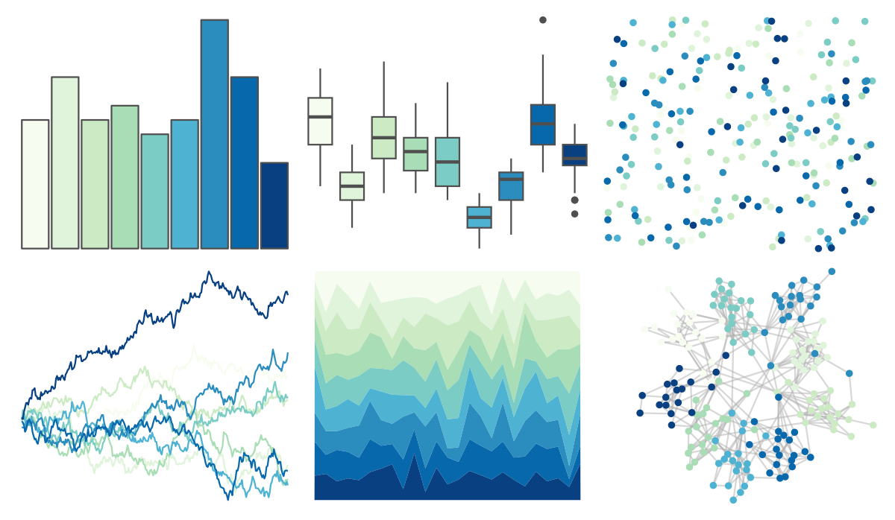

# RColorBrewer - GnBu 

::: columns
::: {.column width="50%"}

**Github**

Not on Github
:::

::: {.column width="50%"}

**CRAN**

[RColorBrewer](https://CRAN.R-project.org/package=RColorBrewer)
:::
:::

<hr> 

Use with [paletteer](https://emilhvitfeldt.github.io/paletteer/) package:

```r
library(paletteer)
paletteer_d("RColorBrewer::GnBu")
```

Use raw:

```r
c("#F7FCF0FF", "#E0F3DBFF", "#CCEBC5FF", "#A8DDB5FF", "#7BCCC4FF", "#4EB3D3FF", "#2B8CBEFF", "#0868ACFF", "#084081FF")
``` 

 

<br>

# Related Palettes

<div class="list" style="display: grid; grid-template-columns: auto auto auto;"> <figure class="figure">
<a href="../../awtools/a_palette/"> </a>
</figure> <figure class="figure">
<a href="../../rcartocolor/DarkMint/"> </a>
</figure> <figure class="figure">
<a href="../../rcartocolor/BluYl/"> </a>
</figure> <figure class="figure">
<a href="../../Redmonder/qMSOBu/"> </a>
</figure> <figure class="figure">
<a href="../../RColorBrewer/YlGnBu/"> </a>
</figure> <figure class="figure">
<a href="../../rcartocolor/Emrld/"> </a>
</figure> <figure class="figure">
<a href="../../rcartocolor/Mint/"> </a>
</figure> <figure class="figure">
<a href="../../miscpalettes/seaGreen/"> </a>
</figure> <figure class="figure">
<a href="../../grDevices/blues9/"> </a>
</figure> <figure class="figure">
<a href="../../RColorBrewer/Blues/"> </a>
</figure> <figure class="figure">
<a href="../../rcartocolor/BluGrn/"> </a>
</figure> <figure class="figure">
<a href="../../Redmonder/qMSOBu2/"> </a>
</figure> 
</div>
