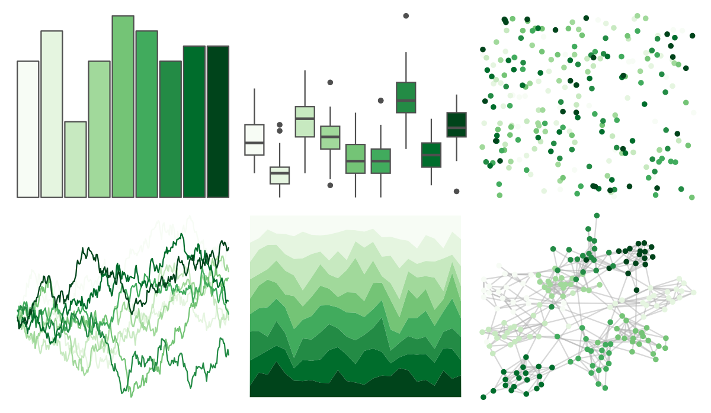
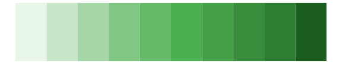

# RColorBrewer - Greens 

::: columns
::: {.column width="50%"}

**Github**

Not on Github
:::

::: {.column width="50%"}

**CRAN**

[RColorBrewer](https://CRAN.R-project.org/package=RColorBrewer)
:::
:::

<hr> 

Use with [paletteer](https://emilhvitfeldt.github.io/paletteer/) package:

```r
library(paletteer)
paletteer_d("RColorBrewer::Greens")
```

Use raw:

```r
c("#F7FCF5FF", "#E5F5E0FF", "#C7E9C0FF", "#A1D99BFF", "#74C476FF", "#41AB5DFF", "#238B45FF", "#006D2CFF", "#00441BFF")
``` 

 

<br>

# Related Palettes

<div class="list" style="display: grid; grid-template-columns: auto auto auto;"> <figure class="figure">
<a href="../../amerika/Dem_Ind_Rep3/"> </a>
</figure> <figure class="figure">
<a href="../../RColorBrewer/YlGn/"> </a>
</figure> <figure class="figure">
<a href="../../ggsci/green_material/"> </a>
</figure> <figure class="figure">
<a href="../../ggsci/green_tw3/"> </a>
</figure> <figure class="figure">
<a href="../../tvthemes/Peridot/"> </a>
</figure> <figure class="figure">
<a href="../../RColorBrewer/BuGn/"> </a>
</figure> <figure class="figure">
<a href="../../Redmonder/qMSOGnYl/"> </a>
</figure> <figure class="figure">
<a href="../../Redmonder/qMSOGn/"> </a>
</figure> <figure class="figure">
<a href="../../MetBrewer/VanGogh3/"> </a>
</figure> <figure class="figure">
<a href="../../Redmonder/sPBIYlGn/"> </a>
</figure> <figure class="figure">
<a href="../../ggsci/emerald_tw3/"> </a>
</figure> <figure class="figure">
<a href="../../tvthemes/EarthKingdom/"> </a>
</figure> 
</div>
