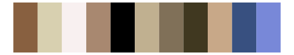

# RColorBrewer - Greys 

::: columns
::: {.column width="50%"}

**Github**

Not on Github
:::

::: {.column width="50%"}

**CRAN**

[RColorBrewer](https://CRAN.R-project.org/package=RColorBrewer)
:::
:::

<hr> 

Use with [paletteer](https://emilhvitfeldt.github.io/paletteer/) package:

```r
library(paletteer)
paletteer_d("RColorBrewer::Greys")
```

Use raw:

```r
c("#FFFFFFFF", "#F0F0F0FF", "#D9D9D9FF", "#BDBDBDFF", "#969696FF", "#737373FF", "#525252FF", "#252525FF", "#000000FF")
``` 

 

<br>

# Related Palettes

<div class="list" style="display: grid; grid-template-columns: auto auto auto;"> <figure class="figure">
<a href="../../awtools/a_palette/"> </a>
</figure> <figure class="figure">
<a href="../../palettetown/silcoon/"> </a>
</figure> <figure class="figure">
<a href="../../ggthemes/stata_mono/"> </a>
</figure> <figure class="figure">
<a href="../../ggthemr/chalk/"> </a>
</figure> <figure class="figure">
<a href="../../ggprism/black_and_white/"> </a>
</figure> <figure class="figure">
<a href="../../palettetown/castform/"> </a>
</figure> <figure class="figure">
<a href="../../tayloRswift/reputation/"> </a>
</figure> <figure class="figure">
<a href="../../ggthemr/greyscale/"> </a>
</figure> <figure class="figure">
<a href="../../ggsci/grey_material/"> </a>
</figure> <figure class="figure">
<a href="../../trekcolors/borg/"> </a>
</figure> <figure class="figure">
<a href="../../palettetown/linoone/"> </a>
</figure> <figure class="figure">
<a href="../../tayloRswift/folklore/"> </a>
</figure> 
</div>
