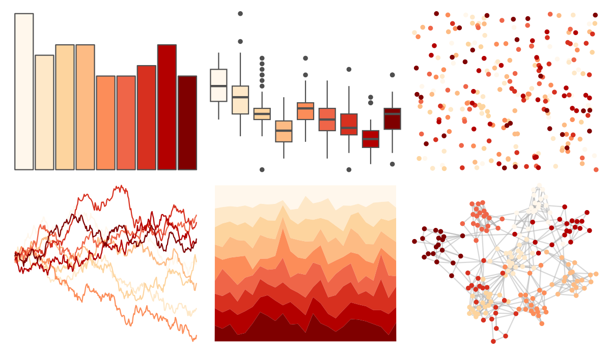

# RColorBrewer - OrRd 

::: columns
::: {.column width="50%"}

**Github**

Not on Github
:::

::: {.column width="50%"}

**CRAN**

[RColorBrewer](https://CRAN.R-project.org/package=RColorBrewer)
:::
:::

<hr> 

Use with [paletteer](https://emilhvitfeldt.github.io/paletteer/) package:

```r
library(paletteer)
paletteer_d("RColorBrewer::OrRd")
```

Use raw:

```r
c("#FFF7ECFF", "#FEE8C8FF", "#FDD49EFF", "#FDBB84FF", "#FC8D59FF", "#EF6548FF", "#D7301FFF", "#B30000FF", "#7F0000FF")
``` 

 

<br>

# Related Palettes

<div class="list" style="display: grid; grid-template-columns: auto auto auto;"> <figure class="figure">
<a href="../../awtools/a_palette/"> </a>
</figure> <figure class="figure">
<a href="../../ButterflyColors/hamadryas_feronia/"> </a>
</figure> <figure class="figure">
<a href="../../ButterflyColors/hamadryas_feronia/"> </a>
</figure> <figure class="figure">
<a href="../../RColorBrewer/Oranges/"> </a>
</figure> <figure class="figure">
<a href="../../RColorBrewer/Reds/"> </a>
</figure> <figure class="figure">
<a href="../../RColorBrewer/YlOrRd/"> </a>
</figure> <figure class="figure">
<a href="../../RColorBrewer/YlOrBr/"> </a>
</figure> <figure class="figure">
<a href="../../khroma/YlOrBr/"> </a>
</figure> <figure class="figure">
<a href="../../MetBrewer/OKeeffe2/"> </a>
</figure> <figure class="figure">
<a href="../../ggsci/deep_orange_material/"> </a>
</figure> <figure class="figure">
<a href="../../miscpalettes/jojo/"> </a>
</figure> <figure class="figure">
<a href="../../MoMAColors/Connors/"> </a>
</figure> 
</div>
