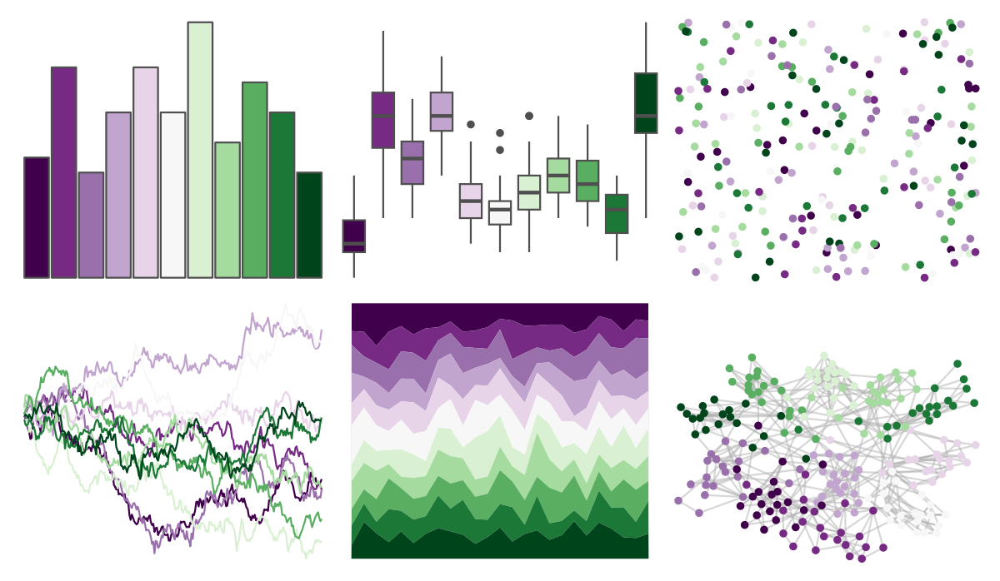
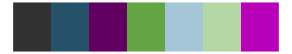

# RColorBrewer - PRGn 

::: columns
::: {.column width="50%"}

**Github**

Not on Github
:::

::: {.column width="50%"}

**CRAN**

[RColorBrewer](https://CRAN.R-project.org/package=RColorBrewer)
:::
:::

<hr> 

Use with [paletteer](https://emilhvitfeldt.github.io/paletteer/) package:

```r
library(paletteer)
paletteer_d("RColorBrewer::PRGn")
```

Use raw:

```r
c("#40004BFF", "#762A83FF", "#9970ABFF", "#C2A5CFFF", "#E7D4E8FF", "#F7F7F7FF", "#D9F0D3FF", "#A6DBA0FF", "#5AAE61FF", "#1B7837FF", "#00441BFF")
``` 

 

<br>

# Related Palettes

<div class="list" style="display: grid; grid-template-columns: auto auto auto;"> <figure class="figure">
<a href="../../amerika/Dem_Ind_Rep3/"> </a>
</figure> <figure class="figure">
<a href="../../PrettyCols/PurpleGreens/"> </a>
</figure> <figure class="figure">
<a href="../../palettetown/regice/"> </a>
</figure> <figure class="figure">
<a href="../../palettetown/nidoking/"> </a>
</figure> <figure class="figure">
<a href="../../palettetown/dratini/"> </a>
</figure> <figure class="figure">
<a href="../../RColorBrewer/PiYG/"> </a>
</figure> <figure class="figure">
<a href="../../ggthemr/lilac/"> </a>
</figure> <figure class="figure">
<a href="../../khroma/PRGn/"> </a>
</figure> <figure class="figure">
<a href="../../palettetown/roselia/"> </a>
</figure> <figure class="figure">
<a href="../../PrettyCols/PinkGreens/"> </a>
</figure> <figure class="figure">
<a href="../../palettetown/seadra/"> </a>
</figure> <figure class="figure">
<a href="../../trekcolors/dominion/"> </a>
</figure> 
</div>
