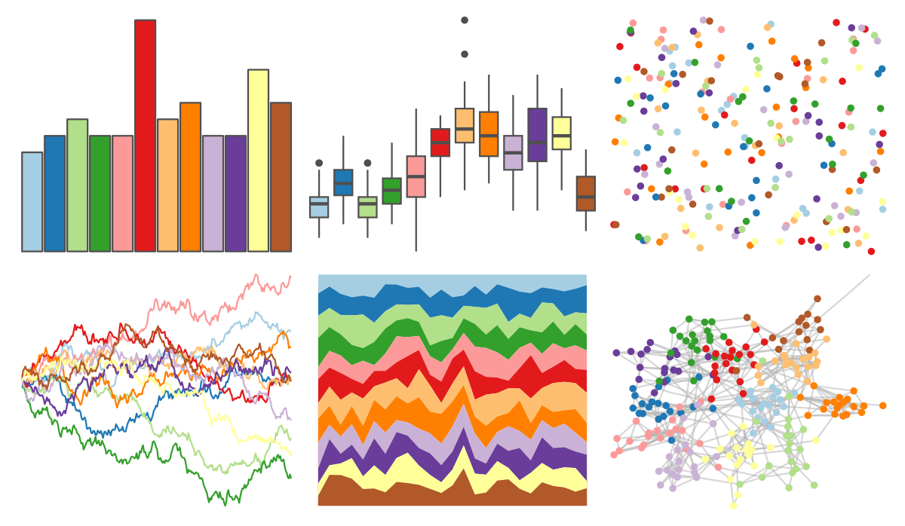

# RColorBrewer - Paired 

::: columns
::: {.column width="50%"}

**Github**

Not on Github
:::

::: {.column width="50%"}

**CRAN**

[RColorBrewer](https://CRAN.R-project.org/package=RColorBrewer)
:::
:::

<hr> 

Use with [paletteer](https://emilhvitfeldt.github.io/paletteer/) package:

```r
library(paletteer)
paletteer_d("RColorBrewer::Paired")
```

Use raw:

```r
c("#A6CEE3FF", "#1F78B4FF", "#B2DF8AFF", "#33A02CFF", "#FB9A99FF", "#E31A1CFF", "#FDBF6FFF", "#FF7F00FF", "#CAB2D6FF", "#6A3D9AFF", "#FFFF99FF", "#B15928FF")
``` 

 

<br>

# Related Palettes

<div class="list" style="display: grid; grid-template-columns: auto auto auto;"> <figure class="figure">
<a href="../../awtools/a_palette/"> </a>
</figure> <figure class="figure">
<a href="../../ButterflyColors/hamadryas_feronia/"> </a>
</figure> <figure class="figure">
<a href="../../ButterflyColors/hamadryas_feronia/"> </a>
</figure> <figure class="figure">
<a href="../../tidyquant/tq_light/"> </a>
</figure> <figure class="figure">
<a href="../../tidyquant/tq_dark/"> </a>
</figure> <figure class="figure">
<a href="../../ggthemr/flat_dark/"> </a>
</figure> <figure class="figure">
<a href="../../basetheme/dark/"> </a>
</figure> <figure class="figure">
<a href="../../tidyquant/tq_green/"> </a>
</figure> <figure class="figure">
<a href="../../RColorBrewer/Spectral/"> </a>
</figure> <figure class="figure">
<a href="../../peRReo/calle13/"> </a>
</figure> <figure class="figure">
<a href="../../awtools/mpalette/"> </a>
</figure> <figure class="figure">
<a href="../../basetheme/brutal/"> </a>
</figure> 
</div>
