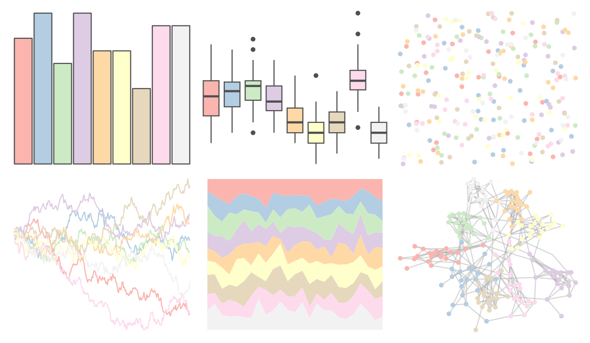
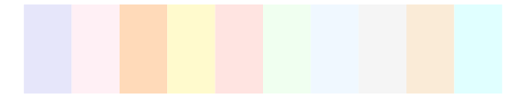

# RColorBrewer - Pastel1 

::: columns
::: {.column width="50%"}

**Github**

Not on Github
:::

::: {.column width="50%"}

**CRAN**

[RColorBrewer](https://CRAN.R-project.org/package=RColorBrewer)
:::
:::

<hr> 

Use with [paletteer](https://emilhvitfeldt.github.io/paletteer/) package:

```r
library(paletteer)
paletteer_d("RColorBrewer::Pastel1")
```

Use raw:

```r
c("#FBB4AEFF", "#B3CDE3FF", "#CCEBC5FF", "#DECBE4FF", "#FED9A6FF", "#FFFFCCFF", "#E5D8BDFF", "#FDDAECFF", "#F2F2F2FF")
``` 

 

<br>

# Related Palettes

<div class="list" style="display: grid; grid-template-columns: auto auto auto;"> <figure class="figure">
<a href="../../awtools/a_palette/"> </a>
</figure> <figure class="figure">
<a href="../../RColorBrewer/Pastel2/"> </a>
</figure> <figure class="figure">
<a href="../../khroma/pale/"> </a>
</figure> <figure class="figure">
<a href="../../tvthemes/MegaPearl/"> </a>
</figure> <figure class="figure">
<a href="../../miscpalettes/light/"> </a>
</figure> <figure class="figure">
<a href="../../ggthemes/Classic_10_Light/"> </a>
</figure> <figure class="figure">
<a href="../../yarrr/ipod/"> </a>
</figure> <figure class="figure">
<a href="../../ghibli/PonyoLight/"> </a>
</figure> <figure class="figure">
<a href="../../ghibli/MarnieLight1/"> </a>
</figure> <figure class="figure">
<a href="../../rcartocolor/Pastel/"> </a>
</figure> <figure class="figure">
<a href="../../RColorBrewer/Set3/"> </a>
</figure> <figure class="figure">
<a href="../../ggthemes/few_Light/"> </a>
</figure> 
</div>
