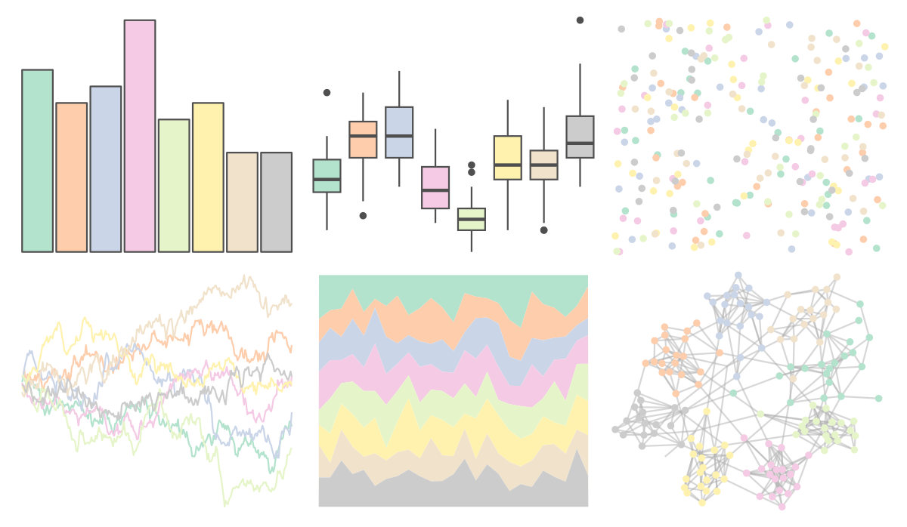

# RColorBrewer - Pastel2 

::: columns
::: {.column width="50%"}

**Github**

Not on Github
:::

::: {.column width="50%"}

**CRAN**

[RColorBrewer](https://CRAN.R-project.org/package=RColorBrewer)
:::
:::

<hr> 

Use with [paletteer](https://emilhvitfeldt.github.io/paletteer/) package:

```r
library(paletteer)
paletteer_d("RColorBrewer::Pastel2")
```

Use raw:

```r
c("#B3E2CDFF", "#FDCDACFF", "#CBD5E8FF", "#F4CAE4FF", "#E6F5C9FF", "#FFF2AEFF", "#F1E2CCFF", "#CCCCCCFF")
``` 

 

<br>

# Related Palettes

<div class="list" style="display: grid; grid-template-columns: auto auto auto;"> <figure class="figure">
<a href="../../amerika/Dem_Ind_Rep3/"> </a>
</figure> <figure class="figure">
<a href="../../RColorBrewer/Pastel1/"> </a>
</figure> <figure class="figure">
<a href="../../khroma/pale/"> </a>
</figure> <figure class="figure">
<a href="../../miscpalettes/light/"> </a>
</figure> <figure class="figure">
<a href="../../yarrr/ipod/"> </a>
</figure> <figure class="figure">
<a href="../../ggthemes/Classic_10_Light/"> </a>
</figure> <figure class="figure">
<a href="../../ghibli/PonyoLight/"> </a>
</figure> <figure class="figure">
<a href="../../tvthemes/MegaPearl/"> </a>
</figure> <figure class="figure">
<a href="../../PrettyCols/Spring/"> </a>
</figure> <figure class="figure">
<a href="../../ltc/paloma/"> </a>
</figure> <figure class="figure">
<a href="../../ltc/olga/"> </a>
</figure> <figure class="figure">
<a href="../../fishualize/Lycengraulis_grossidens/"> </a>
</figure> 
</div>
