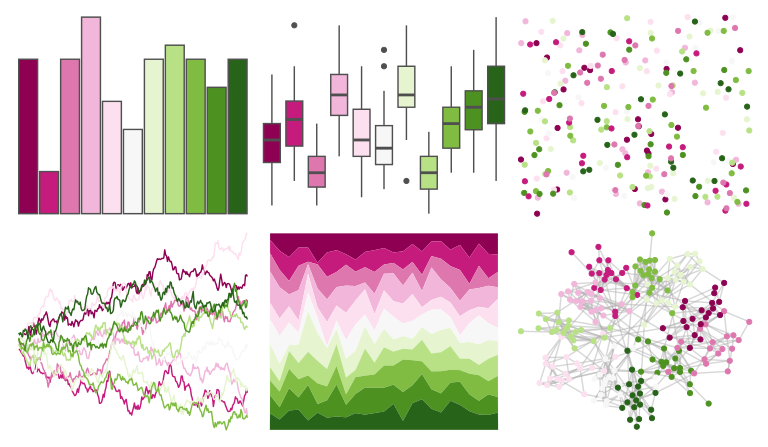

# RColorBrewer - PiYG 

::: columns
::: {.column width="50%"}

**Github**

Not on Github
:::

::: {.column width="50%"}

**CRAN**

[RColorBrewer](https://CRAN.R-project.org/package=RColorBrewer)
:::
:::

<hr> 

Use with [paletteer](https://emilhvitfeldt.github.io/paletteer/) package:

```r
library(paletteer)
paletteer_d("RColorBrewer::PiYG")
```

Use raw:

```r
c("#8E0152FF", "#C51B7DFF", "#DE77AEFF", "#F1B6DAFF", "#FDE0EFFF", "#F7F7F7FF", "#E6F5D0FF", "#B8E186FF", "#7FBC41FF", "#4D9221FF", "#276419FF")
``` 

 

<br>

# Related Palettes

<div class="list" style="display: grid; grid-template-columns: auto auto auto;"> <figure class="figure">
<a href="../../awtools/a_palette/"> </a>
</figure> <figure class="figure">
<a href="../../RColorBrewer/PRGn/"> </a>
</figure> <figure class="figure">
<a href="../../Redmonder/dPBIYlPu/"> </a>
</figure> <figure class="figure">
<a href="../../palettetown/jolteon/"> </a>
</figure> <figure class="figure">
<a href="../../palettetown/nidoking/"> </a>
</figure> <figure class="figure">
<a href="../../palettetown/ivysaur/"> </a>
</figure> <figure class="figure">
<a href="../../colRoz/n_violacea/"> </a>
</figure> <figure class="figure">
<a href="../../palettetown/qwilfish/"> </a>
</figure> <figure class="figure">
<a href="../../palettetown/regice/"> </a>
</figure> <figure class="figure">
<a href="../../khroma/PRGn/"> </a>
</figure> <figure class="figure">
<a href="../../palettetown/roselia/"> </a>
</figure> <figure class="figure">
<a href="../../palettetown/heracross/"> </a>
</figure> 
</div>
