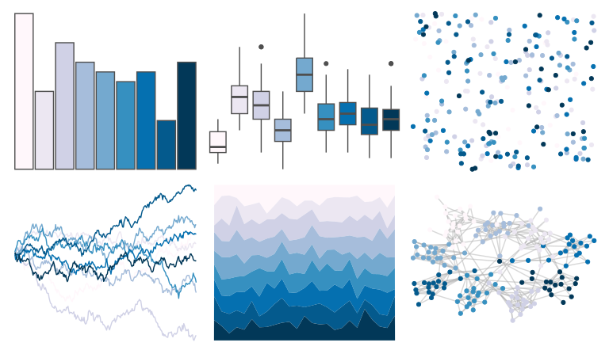

# RColorBrewer - PuBu 

::: columns
::: {.column width="50%"}

**Github**

Not on Github
:::

::: {.column width="50%"}

**CRAN**

[RColorBrewer](https://CRAN.R-project.org/package=RColorBrewer)
:::
:::

<hr> 

Use with [paletteer](https://emilhvitfeldt.github.io/paletteer/) package:

```r
library(paletteer)
paletteer_d("RColorBrewer::PuBu")
```

Use raw:

```r
c("#FFF7FBFF", "#ECE7F2FF", "#D0D1E6FF", "#A6BDDBFF", "#74A9CFFF", "#3690C0FF", "#0570B0FF", "#045A8DFF", "#023858FF")
``` 

 

<br>

# Related Palettes

<div class="list" style="display: grid; grid-template-columns: auto auto auto;"> <figure class="figure">
<a href="../../awtools/a_palette/"> </a>
</figure> <figure class="figure">
<a href="../../grDevices/blues9/"> </a>
</figure> <figure class="figure">
<a href="../../RColorBrewer/Blues/"> </a>
</figure> <figure class="figure">
<a href="../../RColorBrewer/PuBuGn/"> </a>
</figure> <figure class="figure">
<a href="../../beyonce/X43/"> </a>
</figure> <figure class="figure">
<a href="../../palettetown/lugia/"> </a>
</figure> <figure class="figure">
<a href="../../palettetown/dragonair/"> </a>
</figure> <figure class="figure">
<a href="../../RColorBrewer/Purples/"> </a>
</figure> <figure class="figure">
<a href="../../RColorBrewer/BuPu/"> </a>
</figure> <figure class="figure">
<a href="../../tvthemes/WaterTribe/"> </a>
</figure> <figure class="figure">
<a href="../../lisa/HansHofmann/"> </a>
</figure> <figure class="figure">
<a href="../../palettetown/mantine/"> </a>
</figure> 
</div>
