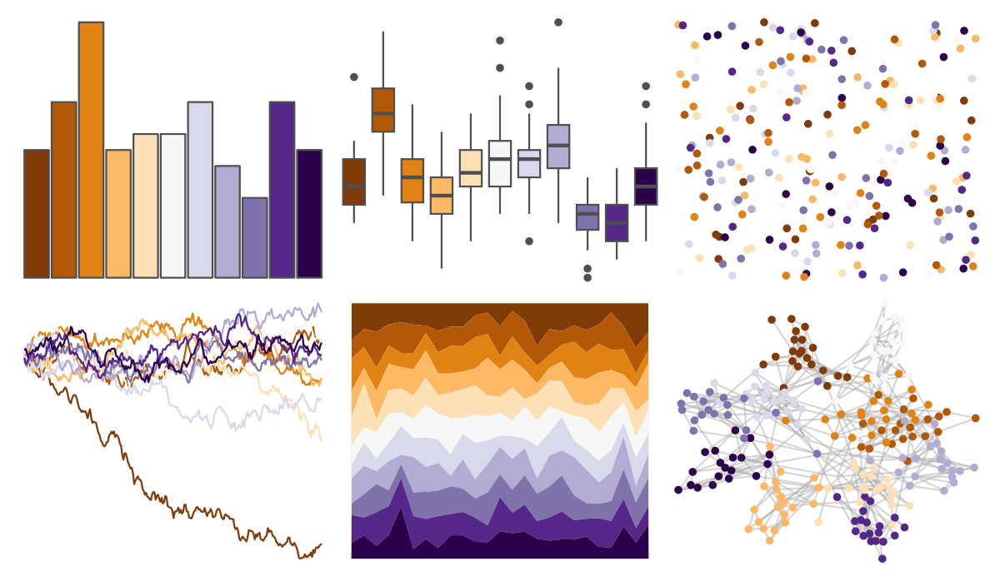
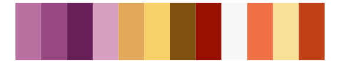

# RColorBrewer - PuOr 

::: columns
::: {.column width="50%"}

**Github**

Not on Github
:::

::: {.column width="50%"}

**CRAN**

[RColorBrewer](https://CRAN.R-project.org/package=RColorBrewer)
:::
:::

<hr> 

Use with [paletteer](https://emilhvitfeldt.github.io/paletteer/) package:

```r
library(paletteer)
paletteer_d("RColorBrewer::PuOr")
```

Use raw:

```r
c("#7F3B08FF", "#B35806FF", "#E08214FF", "#FDB863FF", "#FEE0B6FF", "#F7F7F7FF", "#D8DAEBFF", "#B2ABD2FF", "#8073ACFF", "#542788FF", "#2D004BFF")
``` 

 

<br>

# Related Palettes

<div class="list" style="display: grid; grid-template-columns: auto auto auto;"> <figure class="figure">
<a href="../../awtools/a_palette/"> </a>
</figure> <figure class="figure">
<a href="../../ButterflyColors/hamadryas_feronia/"> </a>
</figure> <figure class="figure">
<a href="../../ButterflyColors/hamadryas_feronia/"> </a>
</figure> <figure class="figure">
<a href="../../NatParksPalettes/Acadia/"> </a>
</figure> <figure class="figure">
<a href="../../RColorBrewer/RdBu/"> </a>
</figure> <figure class="figure">
<a href="../../palettetown/totodile/"> </a>
</figure> <figure class="figure">
<a href="../../palettetown/huntail/"> </a>
</figure> <figure class="figure">
<a href="../../PrettyCols/PurpleTangerines/"> </a>
</figure> <figure class="figure">
<a href="../../palettetown/ekans/"> </a>
</figure> <figure class="figure">
<a href="../../MetBrewer/Renoir/"> </a>
</figure> <figure class="figure">
<a href="../../palettetown/gloom/"> </a>
</figure> <figure class="figure">
<a href="../../palettetown/misdreavus/"> </a>
</figure> 
</div>
