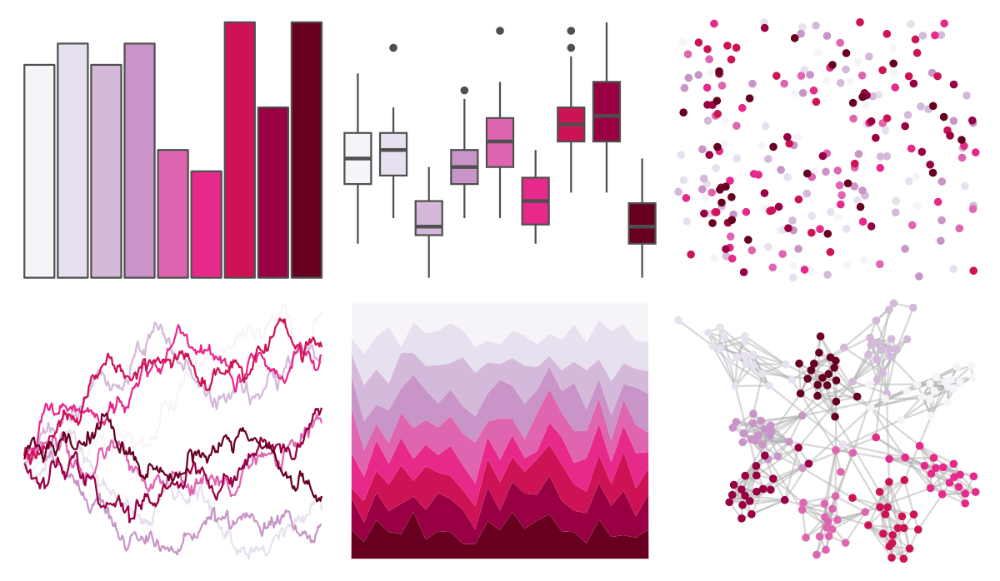

# RColorBrewer - PuRd 

::: columns
::: {.column width="50%"}

**Github**

Not on Github
:::

::: {.column width="50%"}

**CRAN**

[RColorBrewer](https://CRAN.R-project.org/package=RColorBrewer)
:::
:::

<hr> 

Use with [paletteer](https://emilhvitfeldt.github.io/paletteer/) package:

```r
library(paletteer)
paletteer_d("RColorBrewer::PuRd")
```

Use raw:

```r
c("#F7F4F9FF", "#E7E1EFFF", "#D4B9DAFF", "#C994C7FF", "#DF65B0FF", "#E7298AFF", "#CE1256FF", "#980043FF", "#67001FFF")
``` 

 

<br>

# Related Palettes

<div class="list" style="display: grid; grid-template-columns: auto auto auto;"> <figure class="figure">
<a href="../../awtools/a_palette/"> </a>
</figure> <figure class="figure">
<a href="../../ButterflyColors/hamadryas_feronia/"> </a>
</figure> <figure class="figure">
<a href="../../ButterflyColors/hamadryas_feronia/"> </a>
</figure> <figure class="figure">
<a href="../../palettetown/forretress/"> </a>
</figure> <figure class="figure">
<a href="../../tvthemes/Spinel/"> </a>
</figure> <figure class="figure">
<a href="../../tvthemes/Sardonyx/"> </a>
</figure> <figure class="figure">
<a href="../../beyonce/X92/"> </a>
</figure> <figure class="figure">
<a href="../../RColorBrewer/RdPu/"> </a>
</figure> <figure class="figure">
<a href="../../tvthemes/RoseQuartz/"> </a>
</figure> <figure class="figure">
<a href="../../palettetown/haunter/"> </a>
</figure> <figure class="figure">
<a href="../../PrettyCols/PurplePinks/"> </a>
</figure> <figure class="figure">
<a href="../../beyonce/X57/"> </a>
</figure> 
</div>
