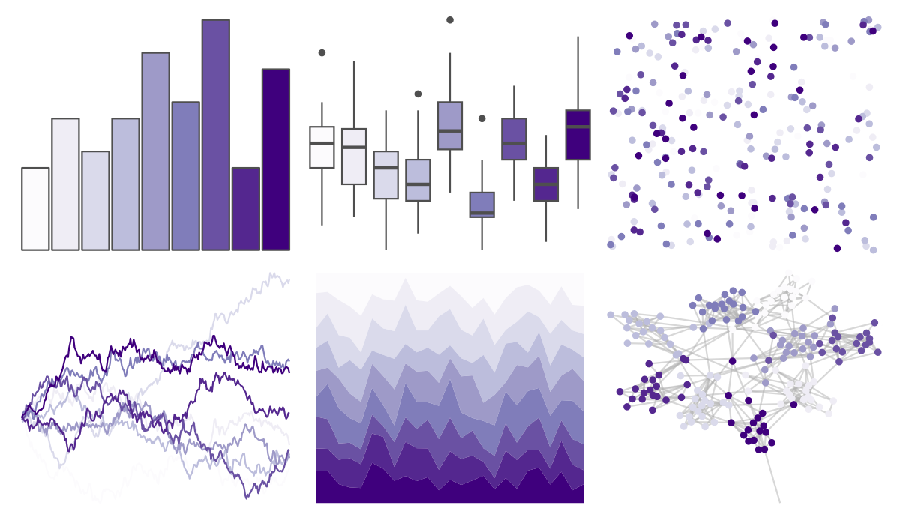

# RColorBrewer - Purples 

::: columns
::: {.column width="50%"}

**Github**

Not on Github
:::

::: {.column width="50%"}

**CRAN**

[RColorBrewer](https://CRAN.R-project.org/package=RColorBrewer)
:::
:::

<hr> 

Use with [paletteer](https://emilhvitfeldt.github.io/paletteer/) package:

```r
library(paletteer)
paletteer_d("RColorBrewer::Purples")
```

Use raw:

```r
c("#FCFBFDFF", "#EFEDF5FF", "#DADAEBFF", "#BCBDDCFF", "#9E9AC8FF", "#807DBAFF", "#6A51A3FF", "#54278FFF", "#3F007DFF")
``` 

 

<br>

# Related Palettes

<div class="list" style="display: grid; grid-template-columns: auto auto auto;"> <figure class="figure">
<a href="../../awtools/a_palette/"> </a>
</figure> <figure class="figure">
<a href="../../ButterflyColors/hamadryas_feronia/"> </a>
</figure> <figure class="figure">
<a href="../../ButterflyColors/hamadryas_feronia/"> </a>
</figure> <figure class="figure">
<a href="../../RColorBrewer/BuPu/"> </a>
</figure> <figure class="figure">
<a href="../../palettetown/lugia/"> </a>
</figure> <figure class="figure">
<a href="../../RColorBrewer/PuBu/"> </a>
</figure> <figure class="figure">
<a href="../../beyonce/X43/"> </a>
</figure> <figure class="figure">
<a href="../../beyonce/X11/"> </a>
</figure> <figure class="figure">
<a href="../../palettetown/dragonair/"> </a>
</figure> <figure class="figure">
<a href="../../palettetown/mantine/"> </a>
</figure> <figure class="figure">
<a href="../../trekcolors/ufp/"> </a>
</figure> <figure class="figure">
<a href="../../grDevices/blues9/"> </a>
</figure> 
</div>
