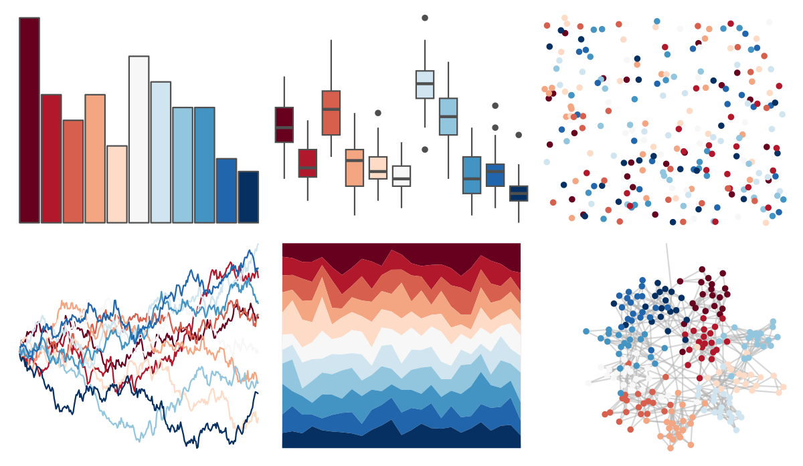

# RColorBrewer - RdBu 

::: columns
::: {.column width="50%"}

**Github**

Not on Github
:::

::: {.column width="50%"}

**CRAN**

[RColorBrewer](https://CRAN.R-project.org/package=RColorBrewer)
:::
:::

<hr> 

Use with [paletteer](https://emilhvitfeldt.github.io/paletteer/) package:

```r
library(paletteer)
paletteer_d("RColorBrewer::RdBu")
```

Use raw:

```r
c("#67001FFF", "#B2182BFF", "#D6604DFF", "#F4A582FF", "#FDDBC7FF", "#F7F7F7FF", "#D1E5F0FF", "#92C5DEFF", "#4393C3FF", "#2166ACFF", "#053061FF")
``` 

 

<br>

# Related Palettes

<div class="list" style="display: grid; grid-template-columns: auto auto auto;"> <figure class="figure">
<a href="../../awtools/a_palette/"> </a>
</figure> <figure class="figure">
<a href="../../ButterflyColors/hamadryas_feronia/"> </a>
</figure> <figure class="figure">
<a href="../../ButterflyColors/hamadryas_feronia/"> </a>
</figure> <figure class="figure">
<a href="../../palettetown/phanpy/"> </a>
</figure> <figure class="figure">
<a href="../../MetBrewer/OKeeffe1/"> </a>
</figure> <figure class="figure">
<a href="../../NatParksPalettes/Arches/"> </a>
</figure> <figure class="figure">
<a href="../../palettetown/totodile/"> </a>
</figure> <figure class="figure">
<a href="../../PrettyCols/RedBlues/"> </a>
</figure> <figure class="figure">
<a href="../../palettetown/nidoranf/"> </a>
</figure> <figure class="figure">
<a href="../../palettetown/nidorina/"> </a>
</figure> <figure class="figure">
<a href="../../RColorBrewer/PuOr/"> </a>
</figure> <figure class="figure">
<a href="../../palettetown/marill/"> </a>
</figure> 
</div>
