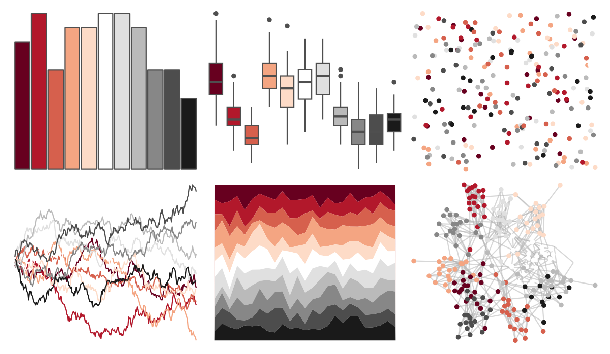
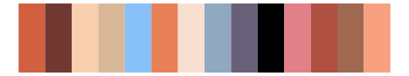

# RColorBrewer - RdGy 

::: columns
::: {.column width="50%"}

**Github**

Not on Github
:::

::: {.column width="50%"}

**CRAN**

[RColorBrewer](https://CRAN.R-project.org/package=RColorBrewer)
:::
:::

<hr> 

Use with [paletteer](https://emilhvitfeldt.github.io/paletteer/) package:

```r
library(paletteer)
paletteer_d("RColorBrewer::RdGy")
```

Use raw:

```r
c("#67001FFF", "#B2182BFF", "#D6604DFF", "#F4A582FF", "#FDDBC7FF", "#FFFFFFFF", "#E0E0E0FF", "#BABABAFF", "#878787FF", "#4D4D4DFF", "#1A1A1AFF")
``` 

 

<br>

# Related Palettes

<div class="list" style="display: grid; grid-template-columns: auto auto auto;"> <figure class="figure">
<a href="../../awtools/a_palette/"> </a>
</figure> <figure class="figure">
<a href="../../palettetown/torkoal/"> </a>
</figure> <figure class="figure">
<a href="../../palettetown/milotic/"> </a>
</figure> <figure class="figure">
<a href="../../palettetown/slakoth/"> </a>
</figure> <figure class="figure">
<a href="../../palettetown/dusclops/"> </a>
</figure> <figure class="figure">
<a href="../../palettetown/houndour/"> </a>
</figure> <figure class="figure">
<a href="../../palettetown/vigoroth/"> </a>
</figure> <figure class="figure">
<a href="../../palettetown/masquerain/"> </a>
</figure> <figure class="figure">
<a href="../../palettetown/goldeen/"> </a>
</figure> <figure class="figure">
<a href="../../palettetown/houndoom/"> </a>
</figure> <figure class="figure">
<a href="../../Redmonder/dPBIRdGy/"> </a>
</figure> <figure class="figure">
<a href="../../palettetown/electrode/"> </a>
</figure> 
</div>
