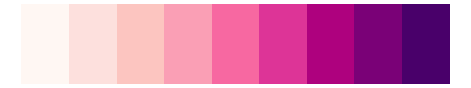
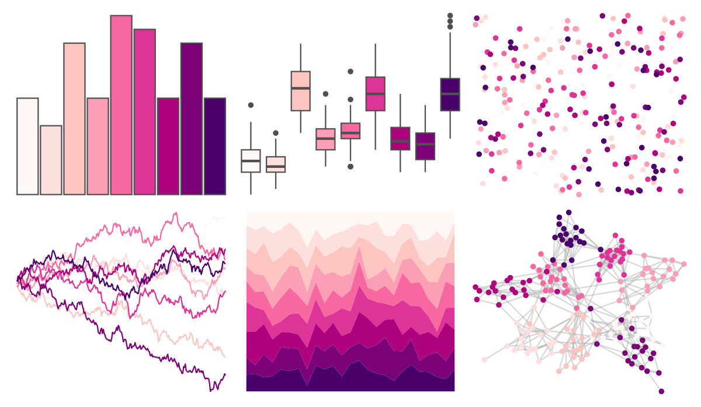
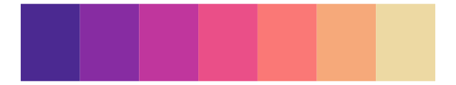
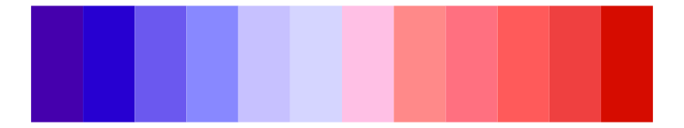
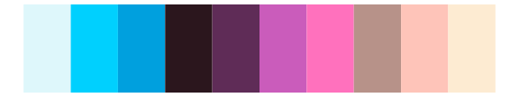

# RColorBrewer - RdPu 

::: columns
::: {.column width="50%"}

**Github**

Not on Github
:::

::: {.column width="50%"}

**CRAN**

[RColorBrewer](https://CRAN.R-project.org/package=RColorBrewer)
:::
:::

<hr> 

Use with [paletteer](https://emilhvitfeldt.github.io/paletteer/) package:

```r
library(paletteer)
paletteer_d("RColorBrewer::RdPu")
```

Use raw:

```r
c("#FFF7F3FF", "#FDE0DDFF", "#FCC5C0FF", "#FA9FB5FF", "#F768A1FF", "#DD3497FF", "#AE017EFF", "#7A0177FF", "#49006AFF")
``` 

 

<br>

# Related Palettes

<div class="list" style="display: grid; grid-template-columns: auto auto auto;"> <figure class="figure">
<a href="../../awtools/a_palette/"> </a>
</figure> <figure class="figure">
<a href="../../rcartocolor/ag_Sunset/"> </a>
</figure> <figure class="figure">
<a href="../../RColorBrewer/PuRd/"> </a>
</figure> <figure class="figure">
<a href="../../rcartocolor/SunsetDark/"> </a>
</figure> <figure class="figure">
<a href="../../ggsci/default_gsea/"> </a>
</figure> <figure class="figure">
<a href="../../werpals/provence/"> </a>
</figure> <figure class="figure">
<a href="../../LaCroixColoR/CranRaspberry/"> </a>
</figure> <figure class="figure">
<a href="../../RColorBrewer/BuPu/"> </a>
</figure> <figure class="figure">
<a href="../../rcartocolor/PurpOr/"> </a>
</figure> <figure class="figure">
<a href="../../tvthemes/RoseQuartz/"> </a>
</figure> <figure class="figure">
<a href="../../LaCroixColoR/Berry/"> </a>
</figure> <figure class="figure">
<a href="../../tvthemes/Sardonyx/"> </a>
</figure> 
</div>
