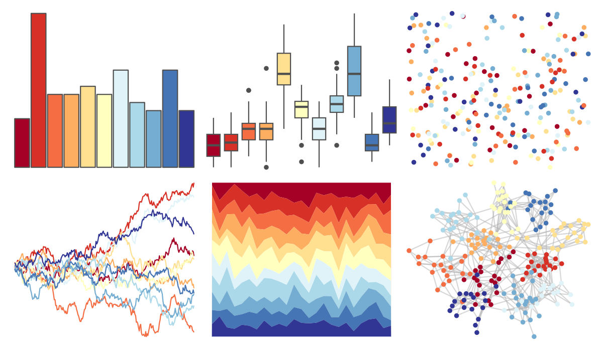

# RColorBrewer - RdYlBu 

::: columns
::: {.column width="50%"}

**Github**

Not on Github
:::

::: {.column width="50%"}

**CRAN**

[RColorBrewer](https://CRAN.R-project.org/package=RColorBrewer)
:::
:::

<hr> 

Use with [paletteer](https://emilhvitfeldt.github.io/paletteer/) package:

```r
library(paletteer)
paletteer_d("RColorBrewer::RdYlBu")
```

Use raw:

```r
c("#A50026FF", "#D73027FF", "#F46D43FF", "#FDAE61FF", "#FEE090FF", "#FFFFBFFF", "#E0F3F8FF", "#ABD9E9FF", "#74ADD1FF", "#4575B4FF", "#313695FF")
``` 

 

<br>

# Related Palettes

<div class="list" style="display: grid; grid-template-columns: auto auto auto;"> <figure class="figure">
<a href="../../amerika/Dem_Ind_Rep3/"> </a>
</figure> <figure class="figure">
<a href="../../khroma/sunset/"> </a>
</figure> <figure class="figure">
<a href="../../RColorBrewer/Spectral/"> </a>
</figure> <figure class="figure">
<a href="../../colorBlindness/ModifiedSpectralScheme11Steps/"> </a>
</figure> <figure class="figure">
<a href="../../MetBrewer/Hiroshige/"> </a>
</figure> <figure class="figure">
<a href="../../colorBlindness/Blue2DarkRed12Steps/"> </a>
</figure> <figure class="figure">
<a href="../../dichromat/DarkRedtoBlue_12/"> </a>
</figure> <figure class="figure">
<a href="../../tidyquant/tq_light/"> </a>
</figure> <figure class="figure">
<a href="../../trekcolors/lcars_nemesis/"> </a>
</figure> <figure class="figure">
<a href="../../MetBrewer/OKeeffe1/"> </a>
</figure> <figure class="figure">
<a href="../../trekcolors/lcars_2357/"> </a>
</figure> <figure class="figure">
<a href="../../palettetown/totodile/"> </a>
</figure> 
</div>
