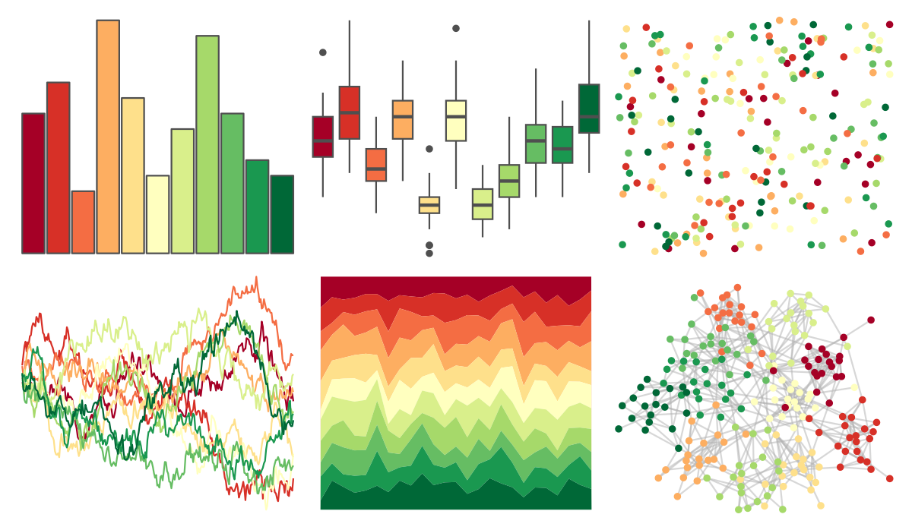

# RColorBrewer - RdYlGn 

::: columns
::: {.column width="50%"}

**Github**

Not on Github
:::

::: {.column width="50%"}

**CRAN**

[RColorBrewer](https://CRAN.R-project.org/package=RColorBrewer)
:::
:::

<hr> 

Use with [paletteer](https://emilhvitfeldt.github.io/paletteer/) package:

```r
library(paletteer)
paletteer_d("RColorBrewer::RdYlGn")
```

Use raw:

```r
c("#A50026FF", "#D73027FF", "#F46D43FF", "#FDAE61FF", "#FEE08BFF", "#FFFFBFFF", "#D9EF8BFF", "#A6D96AFF", "#66BD63FF", "#1A9850FF", "#006837FF")
``` 

 

<br>

# Related Palettes

<div class="list" style="display: grid; grid-template-columns: auto auto auto;"> <figure class="figure">
<a href="../../amerika/Dem_Ind_Rep3/"> </a>
</figure> <figure class="figure">
<a href="../../ggthemes/Traffic/"> </a>
</figure> <figure class="figure">
<a href="../../palettetown/hoppip/"> </a>
</figure> <figure class="figure">
<a href="../../ggthemes/Classic_Traffic_Light/"> </a>
</figure> <figure class="figure">
<a href="../../palettetown/treecko/"> </a>
</figure> <figure class="figure">
<a href="../../palettetown/sceptile/"> </a>
</figure> <figure class="figure">
<a href="../../khroma/incandescent/"> </a>
</figure> <figure class="figure">
<a href="../../MetBrewer/Paquin/"> </a>
</figure> <figure class="figure">
<a href="../../palettetown/bellsprout/"> </a>
</figure> <figure class="figure">
<a href="../../NatParksPalettes/Olympic/"> </a>
</figure> <figure class="figure">
<a href="../../palettetown/lombre/"> </a>
</figure> <figure class="figure">
<a href="../../palettetown/venusaur/"> </a>
</figure> 
</div>
