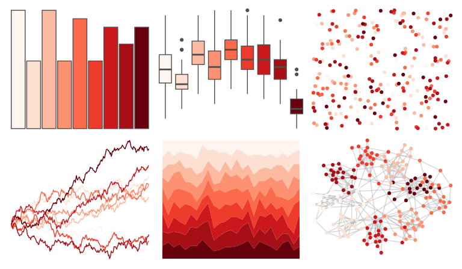

# RColorBrewer - Reds 

::: columns
::: {.column width="50%"}

**Github**

Not on Github
:::

::: {.column width="50%"}

**CRAN**

[RColorBrewer](https://CRAN.R-project.org/package=RColorBrewer)
:::
:::

<hr> 

Use with [paletteer](https://emilhvitfeldt.github.io/paletteer/) package:

```r
library(paletteer)
paletteer_d("RColorBrewer::Reds")
```

Use raw:

```r
c("#FFF5F0FF", "#FEE0D2FF", "#FCBBA1FF", "#FC9272FF", "#FB6A4AFF", "#EF3B2CFF", "#CB181DFF", "#A50F15FF", "#67000DFF")
``` 

 

<br>

# Related Palettes

<div class="list" style="display: grid; grid-template-columns: auto auto auto;"> <figure class="figure">
<a href="../../awtools/a_palette/"> </a>
</figure> <figure class="figure">
<a href="../../RColorBrewer/OrRd/"> </a>
</figure> <figure class="figure">
<a href="../../RColorBrewer/Oranges/"> </a>
</figure> <figure class="figure">
<a href="../../RColorBrewer/YlOrRd/"> </a>
</figure> <figure class="figure">
<a href="../../ggsci/deep_orange_material/"> </a>
</figure> <figure class="figure">
<a href="../../miscpalettes/jojo/"> </a>
</figure> <figure class="figure">
<a href="../../wesanderson/GrandBudapest1/"> </a>
</figure> <figure class="figure">
<a href="../../ggsci/red_material/"> </a>
</figure> <figure class="figure">
<a href="../../MetBrewer/OKeeffe2/"> </a>
</figure> <figure class="figure">
<a href="../../rcartocolor/BurgYl/"> </a>
</figure> <figure class="figure">
<a href="../../DresdenColor/skingame/"> </a>
</figure> <figure class="figure">
<a href="../../colRoz/l_vestiens/"> </a>
</figure> 
</div>
