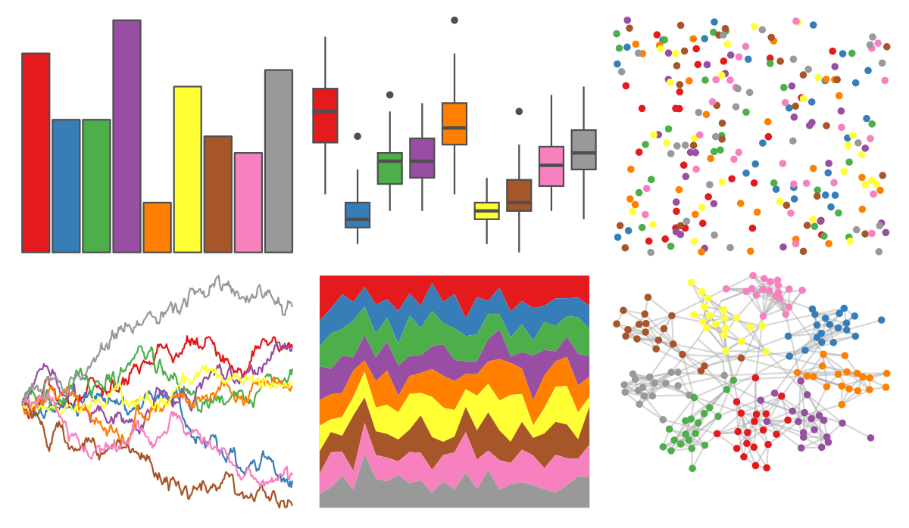

# RColorBrewer - Set1 

::: columns
::: {.column width="50%"}

**Github**

Not on Github
:::

::: {.column width="50%"}

**CRAN**

[RColorBrewer](https://CRAN.R-project.org/package=RColorBrewer)
:::
:::

<hr> 

Use with [paletteer](https://emilhvitfeldt.github.io/paletteer/) package:

```r
library(paletteer)
paletteer_d("RColorBrewer::Set1")
```

Use raw:

```r
c("#E41A1CFF", "#377EB8FF", "#4DAF4AFF", "#984EA3FF", "#FF7F00FF", "#FFFF33FF", "#A65628FF", "#F781BFFF", "#999999FF")
``` 

 

<br>

# Related Palettes

<div class="list" style="display: grid; grid-template-columns: auto auto auto;"> <figure class="figure">
<a href="../../awtools/a_palette/"> </a>
</figure> <figure class="figure">
<a href="../../ButterflyColors/hamadryas_feronia/"> </a>
</figure> <figure class="figure">
<a href="../../ButterflyColors/hamadryas_feronia/"> </a>
</figure> <figure class="figure">
<a href="../../yarrr/xmen/"> </a>
</figure> <figure class="figure">
<a href="../../ggsci/category10_d3/"> </a>
</figure> <figure class="figure">
<a href="../../ggthemes/Classic_10/"> </a>
</figure> <figure class="figure">
<a href="../../ggthemes/few_Medium/"> </a>
</figure> <figure class="figure">
<a href="../../RColorBrewer/Accent/"> </a>
</figure> <figure class="figure">
<a href="../../MetBrewer/Signac/"> </a>
</figure> <figure class="figure">
<a href="../../rcartocolor/Bold/"> </a>
</figure> <figure class="figure">
<a href="../../palettetown/starmie/"> </a>
</figure> <figure class="figure">
<a href="../../awtools/mpalette/"> </a>
</figure> 
</div>
