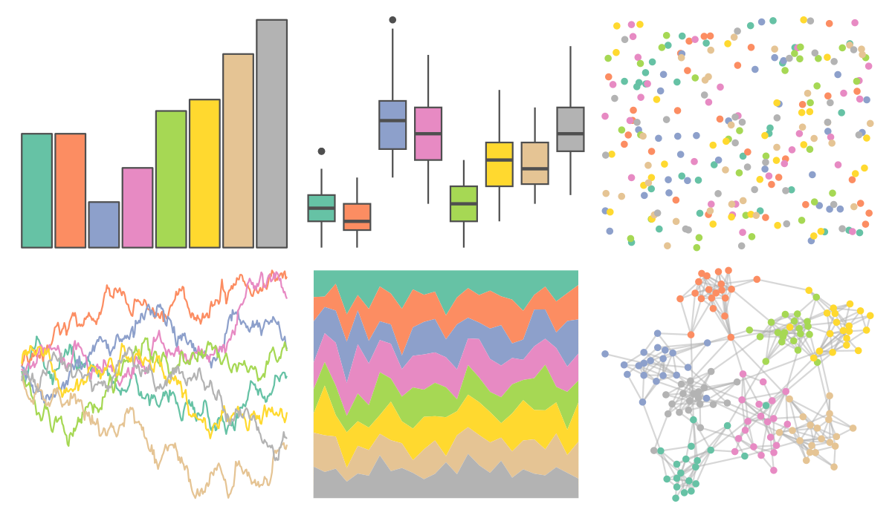
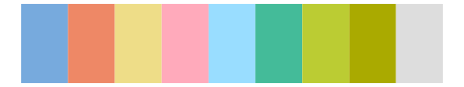

# RColorBrewer - Set2 

::: columns
::: {.column width="50%"}

**Github**

Not on Github
:::

::: {.column width="50%"}

**CRAN**

[RColorBrewer](https://CRAN.R-project.org/package=RColorBrewer)
:::
:::

<hr> 

Use with [paletteer](https://emilhvitfeldt.github.io/paletteer/) package:

```r
library(paletteer)
paletteer_d("RColorBrewer::Set2")
```

Use raw:

```r
c("#66C2A5FF", "#FC8D62FF", "#8DA0CBFF", "#E78AC3FF", "#A6D854FF", "#FFD92FFF", "#E5C494FF", "#B3B3B3FF")
``` 

 

<br>

# Related Palettes

<div class="list" style="display: grid; grid-template-columns: auto auto auto;"> <figure class="figure">
<a href="../../awtools/a_palette/"> </a>
</figure> <figure class="figure">
<a href="../../ggthemes/few_Light/"> </a>
</figure> <figure class="figure">
<a href="../../rcartocolor/Pastel/"> </a>
</figure> <figure class="figure">
<a href="../../RColorBrewer/Set3/"> </a>
</figure> <figure class="figure">
<a href="../../ggthemes/Classic_10_Medium/"> </a>
</figure> <figure class="figure">
<a href="../../ggsci/legacy_tron/"> </a>
</figure> <figure class="figure">
<a href="../../ggthemes/Classic_10_Light/"> </a>
</figure> <figure class="figure">
<a href="../../khroma/light/"> </a>
</figure> <figure class="figure">
<a href="../../ggthemes/excel_Paper/"> </a>
</figure> <figure class="figure">
<a href="../../ggthemes/Jewel_Bright/"> </a>
</figure> <figure class="figure">
<a href="../../ggthemes/Summer/"> </a>
</figure> <figure class="figure">
<a href="../../ggthemes/Superfishel_Stone/"> </a>
</figure> 
</div>
