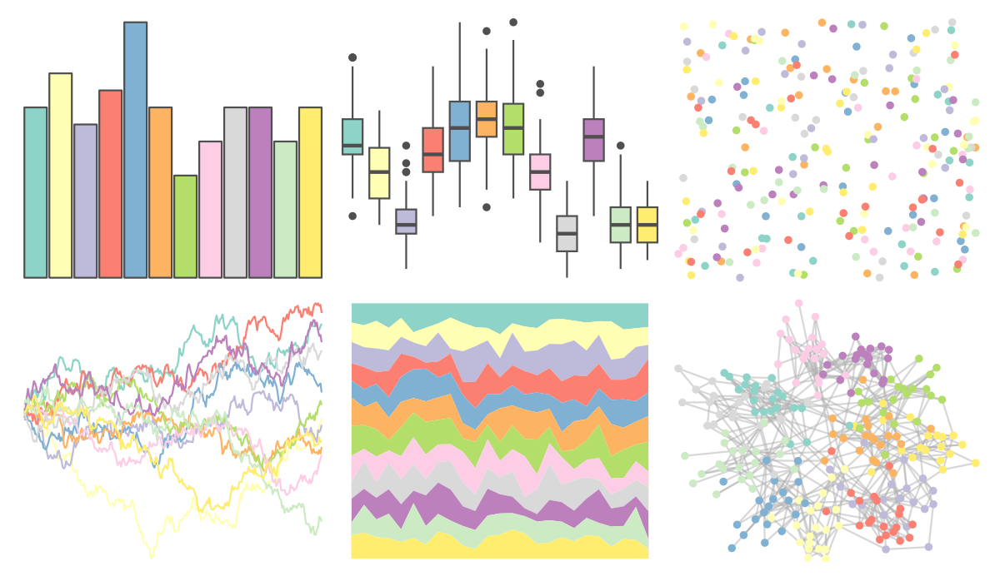

# RColorBrewer - Set3 

::: columns
::: {.column width="50%"}

**Github**

Not on Github
:::

::: {.column width="50%"}

**CRAN**

[RColorBrewer](https://CRAN.R-project.org/package=RColorBrewer)
:::
:::

<hr> 

Use with [paletteer](https://emilhvitfeldt.github.io/paletteer/) package:

```r
library(paletteer)
paletteer_d("RColorBrewer::Set3")
```

Use raw:

```r
c("#8DD3C7FF", "#FFFFB3FF", "#BEBADAFF", "#FB8072FF", "#80B1D3FF", "#FDB462FF", "#B3DE69FF", "#FCCDE5FF", "#D9D9D9FF", "#BC80BDFF", "#CCEBC5FF", "#FFED6FFF")
``` 

 

<br>

# Related Palettes

<div class="list" style="display: grid; grid-template-columns: auto auto auto;"> <figure class="figure">
<a href="../../amerika/Dem_Ind_Rep3/"> </a>
</figure> <figure class="figure">
<a href="../../rcartocolor/Pastel/"> </a>
</figure> <figure class="figure">
<a href="../../RColorBrewer/Set2/"> </a>
</figure> <figure class="figure">
<a href="../../ggthemes/Classic_10_Light/"> </a>
</figure> <figure class="figure">
<a href="../../ggthemes/few_Light/"> </a>
</figure> <figure class="figure">
<a href="../../ggthemes/Classic_10_Medium/"> </a>
</figure> <figure class="figure">
<a href="../../tvthemes/MegaPearl/"> </a>
</figure> <figure class="figure">
<a href="../../khroma/light/"> </a>
</figure> <figure class="figure">
<a href="../../ggsci/legacy_tron/"> </a>
</figure> <figure class="figure">
<a href="../../trekcolors/lcars_alt/"> </a>
</figure> <figure class="figure">
<a href="../../ggthemes/Jewel_Bright/"> </a>
</figure> <figure class="figure">
<a href="../../palettetown/gardevoir/"> </a>
</figure> 
</div>
