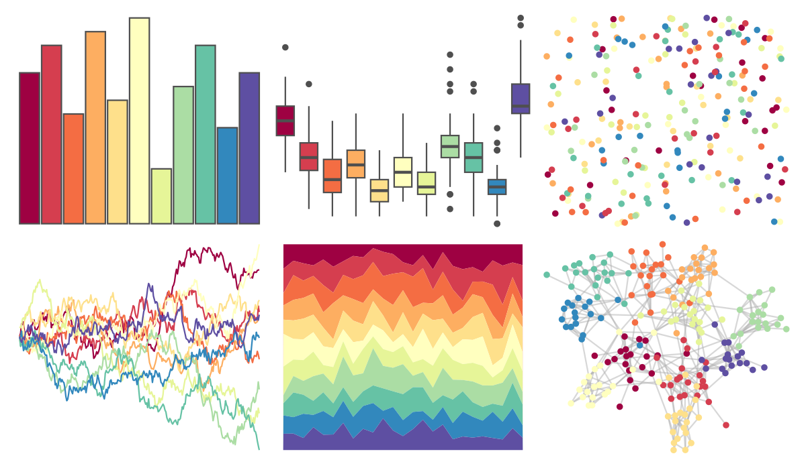

# RColorBrewer - Spectral 

::: columns
::: {.column width="50%"}

**Github**

Not on Github
:::

::: {.column width="50%"}

**CRAN**

[RColorBrewer](https://CRAN.R-project.org/package=RColorBrewer)
:::
:::

<hr> 

Use with [paletteer](https://emilhvitfeldt.github.io/paletteer/) package:

```r
library(paletteer)
paletteer_d("RColorBrewer::Spectral")
```

Use raw:

```r
c("#9E0142FF", "#D53E4FFF", "#F46D43FF", "#FDAE61FF", "#FEE08BFF", "#FFFFBFFF", "#E6F598FF", "#ABDDA4FF", "#66C2A5FF", "#3288BDFF", "#5E4FA2FF")
``` 

 

<br>

# Related Palettes

<div class="list" style="display: grid; grid-template-columns: auto auto auto;"> <figure class="figure">
<a href="../../awtools/a_palette/"> </a>
</figure> <figure class="figure">
<a href="../../ButterflyColors/hamadryas_feronia/"> </a>
</figure> <figure class="figure">
<a href="../../ButterflyColors/hamadryas_feronia/"> </a>
</figure> <figure class="figure">
<a href="../../RColorBrewer/RdYlBu/"> </a>
</figure> <figure class="figure">
<a href="../../khroma/sunset/"> </a>
</figure> <figure class="figure">
<a href="../../palettetown/kingdra/"> </a>
</figure> <figure class="figure">
<a href="../../MetBrewer/Hiroshige/"> </a>
</figure> <figure class="figure">
<a href="../../tidyquant/tq_dark/"> </a>
</figure> <figure class="figure">
<a href="../../tidyquant/tq_light/"> </a>
</figure> <figure class="figure">
<a href="../../palettetown/feraligatr/"> </a>
</figure> <figure class="figure">
<a href="../../trekcolors/lcars_2357/"> </a>
</figure> <figure class="figure">
<a href="../../RColorBrewer/Paired/"> </a>
</figure> 
</div>
