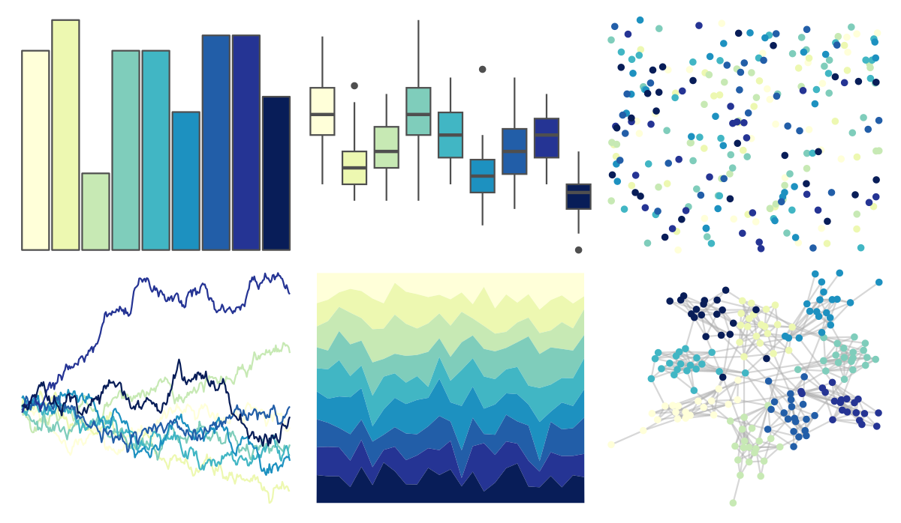

# RColorBrewer - YlGnBu 

::: columns
::: {.column width="50%"}

**Github**

Not on Github
:::

::: {.column width="50%"}

**CRAN**

[RColorBrewer](https://CRAN.R-project.org/package=RColorBrewer)
:::
:::

<hr> 

Use with [paletteer](https://emilhvitfeldt.github.io/paletteer/) package:

```r
library(paletteer)
paletteer_d("RColorBrewer::YlGnBu")
```

Use raw:

```r
c("#FFFFD9FF", "#EDF8B1FF", "#C7E9B4FF", "#7FCDBBFF", "#41B6C4FF", "#1D91C0FF", "#225EA8FF", "#253494FF", "#081D58FF")
``` 

 

<br>

# Related Palettes

<div class="list" style="display: grid; grid-template-columns: auto auto auto;"> <figure class="figure">
<a href="../../awtools/a_palette/"> </a>
</figure> <figure class="figure">
<a href="../../ButterflyColors/hamadryas_feronia/"> </a>
</figure> <figure class="figure">
<a href="../../ButterflyColors/hamadryas_feronia/"> </a>
</figure> <figure class="figure">
<a href="../../Redmonder/qMSOBu/"> </a>
</figure> <figure class="figure">
<a href="../../RColorBrewer/GnBu/"> </a>
</figure> <figure class="figure">
<a href="../../MetBrewer/Hokusai3/"> </a>
</figure> <figure class="figure">
<a href="../../werpals/lakelouise/"> </a>
</figure> <figure class="figure">
<a href="../../NatParksPalettes/Denali/"> </a>
</figure> <figure class="figure">
<a href="../../rcartocolor/BluYl/"> </a>
</figure> <figure class="figure">
<a href="../../MoMAColors/Ernst/"> </a>
</figure> <figure class="figure">
<a href="../../nbapalettes/hornets_believe/"> </a>
</figure> <figure class="figure">
<a href="../../MoMAColors/VanGogh/"> </a>
</figure> 
</div>
