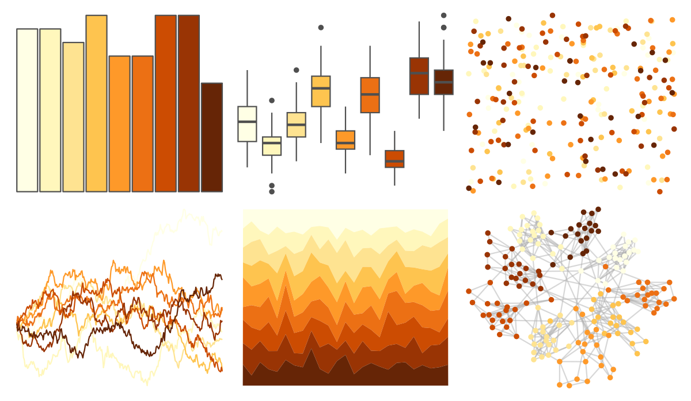
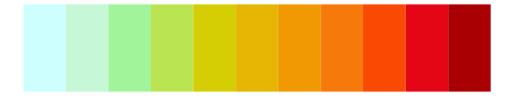

# RColorBrewer - YlOrBr 

::: columns
::: {.column width="50%"}

**Github**

Not on Github
:::

::: {.column width="50%"}

**CRAN**

[RColorBrewer](https://CRAN.R-project.org/package=RColorBrewer)
:::
:::

<hr> 

Use with [paletteer](https://emilhvitfeldt.github.io/paletteer/) package:

```r
library(paletteer)
paletteer_d("RColorBrewer::YlOrBr")
```

Use raw:

```r
c("#FFFFE5FF", "#FFF7BCFF", "#FEE391FF", "#FEC44FFF", "#FE9929FF", "#EC7014FF", "#CC4C02FF", "#993404FF", "#662506FF")
``` 

 

<br>

# Related Palettes

<div class="list" style="display: grid; grid-template-columns: auto auto auto;"> <figure class="figure">
<a href="../../amerika/Dem_Ind_Rep3/"> </a>
</figure> <figure class="figure">
<a href="../../khroma/YlOrBr/"> </a>
</figure> <figure class="figure">
<a href="../../ggsci/amber_tw3/"> </a>
</figure> <figure class="figure">
<a href="../../RColorBrewer/YlOrRd/"> </a>
</figure> <figure class="figure">
<a href="../../RColorBrewer/Oranges/"> </a>
</figure> <figure class="figure">
<a href="../../ggsci/orange_tw3/"> </a>
</figure> <figure class="figure">
<a href="../../RColorBrewer/OrRd/"> </a>
</figure> <figure class="figure">
<a href="../../ggsci/yellow_tw3/"> </a>
</figure> <figure class="figure">
<a href="../../ggsci/orange_bs5/"> </a>
</figure> <figure class="figure">
<a href="../../khroma/incandescent/"> </a>
</figure> <figure class="figure">
<a href="../../beyonce/X59/"> </a>
</figure> <figure class="figure">
<a href="../../palettetown/staryu/"> </a>
</figure> 
</div>
