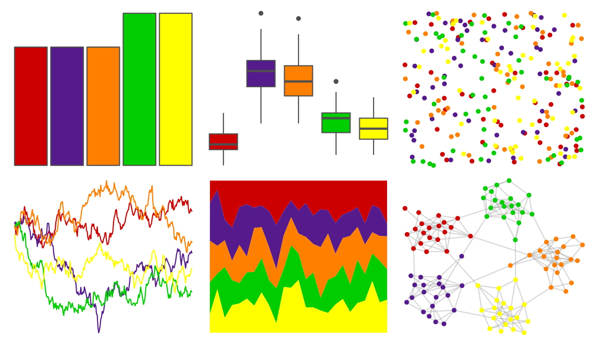

# RSkittleBrewer - original 

::: columns
::: {.column width="50%"}

**Github**

[alyssafrazee/RSkittleBrewer](https://github.com/alyssafrazee/RSkittleBrewer)
:::

::: {.column width="50%"}

**CRAN**

Not on CRAN
:::
:::

<hr> 

Use with [paletteer](https://emilhvitfeldt.github.io/paletteer/) package:

```r
library(paletteer)
paletteer_d("RSkittleBrewer::original")
```

Use raw:

```r
c("#CD0000FF", "#551A8BFF", "#FF7F00FF", "#00CD00FF", "#FFFF00FF")
``` 

 

<br>

# Related Palettes

<div class="list" style="display: grid; grid-template-columns: auto auto auto;"> <figure class="figure">
<a href="../../awtools/a_palette/"> </a>
</figure> <figure class="figure">
<a href="../../RSkittleBrewer/M_M/"> </a>
</figure> <figure class="figure">
<a href="../../jcolors/pal3/"> </a>
</figure> <figure class="figure">
<a href="../../LaCroixColoR/PommeBaya/"> </a>
</figure> <figure class="figure">
<a href="../../fishualize/Synchiropus_splendidus/"> </a>
</figure> <figure class="figure">
<a href="../../yarrr/espresso/"> </a>
</figure> <figure class="figure">
<a href="../../jcolors/pal2/"> </a>
</figure> <figure class="figure">
<a href="../../LaCroixColoR/KeyLime/"> </a>
</figure> <figure class="figure">
<a href="../../fishualize/Holacanthus_ciliaris/"> </a>
</figure> <figure class="figure">
<a href="../../lisa/BillyApple/"> </a>
</figure> <figure class="figure">
<a href="../../fishualize/Coris_gaimard/"> </a>
</figure> <figure class="figure">
<a href="../../PNWColors/Bay/"> </a>
</figure> 
</div>
