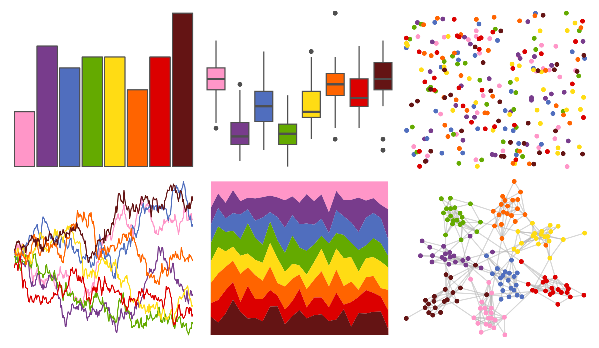

# RSkittleBrewer - smarties 

::: columns
::: {.column width="50%"}

**Github**

[alyssafrazee/RSkittleBrewer](https://github.com/alyssafrazee/RSkittleBrewer)
:::

::: {.column width="50%"}

**CRAN**

Not on CRAN
:::
:::

<hr> 

Use with [paletteer](https://emilhvitfeldt.github.io/paletteer/) package:

```r
library(paletteer)
paletteer_d("RSkittleBrewer::smarties")
```

Use raw:

```r
c("#FF96C8FF", "#783C8CFF", "#506EBEFF", "#64AA00FF", "#FFDC14FF", "#FF6400FF", "#DC0000FF", "#641414FF")
``` 

 

<br>

# Related Palettes

<div class="list" style="display: grid; grid-template-columns: auto auto auto;"> <figure class="figure">
<a href="../../awtools/a_palette/"> </a>
</figure> <figure class="figure">
<a href="../../palettetown/starmie/"> </a>
</figure> <figure class="figure">
<a href="../../LaCroixColoR/KiwiSandia/"> </a>
</figure> <figure class="figure">
<a href="../../jcolors/pal6/"> </a>
</figure> <figure class="figure">
<a href="../../awtools/spalette/"> </a>
</figure> <figure class="figure">
<a href="../../LaCroixColoR/MelonPomelo/"> </a>
</figure> <figure class="figure">
<a href="../../nationalparkcolors/DeathValley/"> </a>
</figure> <figure class="figure">
<a href="../../MetBrewer/Cross/"> </a>
</figure> <figure class="figure">
<a href="../../trekcolors/enara/"> </a>
</figure> <figure class="figure">
<a href="../../LaCroixColoR/PinaFraise/"> </a>
</figure> <figure class="figure">
<a href="../../tvthemes/Sunstone/"> </a>
</figure> <figure class="figure">
<a href="../../MetBrewer/Archambault/"> </a>
</figure> 
</div>
