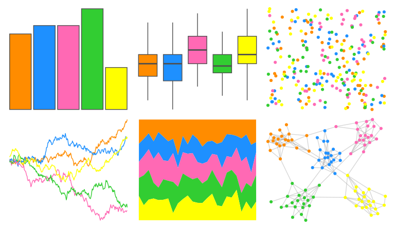

# RSkittleBrewer - tropical 

::: columns
::: {.column width="50%"}

**Github**

[alyssafrazee/RSkittleBrewer](https://github.com/alyssafrazee/RSkittleBrewer)
:::

::: {.column width="50%"}

**CRAN**

Not on CRAN
:::
:::

<hr> 

Use with [paletteer](https://emilhvitfeldt.github.io/paletteer/) package:

```r
library(paletteer)
paletteer_d("RSkittleBrewer::tropical")
```

Use raw:

```r
c("#FF8C00FF", "#1E90FFFF", "#FF69B4FF", "#32CD32FF", "#FFFF00FF")
``` 

 

<br>

# Related Palettes

<div class="list" style="display: grid; grid-template-columns: auto auto auto;"> <figure class="figure">
<a href="../../awtools/a_palette/"> </a>
</figure> <figure class="figure">
<a href="../../lisa/BillyApple/"> </a>
</figure> <figure class="figure">
<a href="../../NineteenEightyR/malibu/"> </a>
</figure> <figure class="figure">
<a href="../../fishualize/Callanthias_australis/"> </a>
</figure> <figure class="figure">
<a href="../../LaCroixColoR/PommeBaya/"> </a>
</figure> <figure class="figure">
<a href="../../fishualize/Sparisoma_viride/"> </a>
</figure> <figure class="figure">
<a href="../../fishualize/Scarus_hoefleri/"> </a>
</figure> <figure class="figure">
<a href="../../fishualize/Coris_gaimard/"> </a>
</figure> <figure class="figure">
<a href="../../yarrr/espresso/"> </a>
</figure> <figure class="figure">
<a href="../../jcolors/pal3/"> </a>
</figure> <figure class="figure">
<a href="../../RSkittleBrewer/original/"> </a>
</figure> <figure class="figure">
<a href="../../RSkittleBrewer/M_M/"> </a>
</figure> 
</div>
