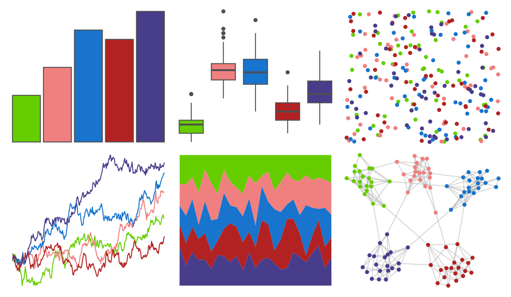

# RSkittleBrewer - wildberry 

::: columns
::: {.column width="50%"}

**Github**

[alyssafrazee/RSkittleBrewer](https://github.com/alyssafrazee/RSkittleBrewer)
:::

::: {.column width="50%"}

**CRAN**

Not on CRAN
:::
:::

<hr> 

Use with [paletteer](https://emilhvitfeldt.github.io/paletteer/) package:

```r
library(paletteer)
paletteer_d("RSkittleBrewer::wildberry")
```

Use raw:

```r
c("#66CD00FF", "#F08080FF", "#1874CDFF", "#B22222FF", "#483D8BFF")
``` 

 

<br>

# Related Palettes

<div class="list" style="display: grid; grid-template-columns: auto auto auto;"> <figure class="figure">
<a href="../../awtools/a_palette/"> </a>
</figure> <figure class="figure">
<a href="../../ButterflyColors/hamadryas_feronia/"> </a>
</figure> <figure class="figure">
<a href="../../ButterflyColors/hamadryas_feronia/"> </a>
</figure> <figure class="figure">
<a href="../../PrettyCols/Bold/"> </a>
</figure> <figure class="figure">
<a href="../../MoMAColors/Ohchi/"> </a>
</figure> <figure class="figure">
<a href="../../waRhol/bighorn_ram_83/"> </a>
</figure> <figure class="figure">
<a href="../../fishualize/Scarus_quoyi/"> </a>
</figure> <figure class="figure">
<a href="../../LaCroixColoR/PassionFruit/"> </a>
</figure> <figure class="figure">
<a href="../../LaCroixColoR/MelonPomelo/"> </a>
</figure> <figure class="figure">
<a href="../../khroma/mediumcontrast/"> </a>
</figure> <figure class="figure">
<a href="../../rockthemes/deelite/"> </a>
</figure> <figure class="figure">
<a href="../../MoMAColors/Andri/"> </a>
</figure> 
</div>
