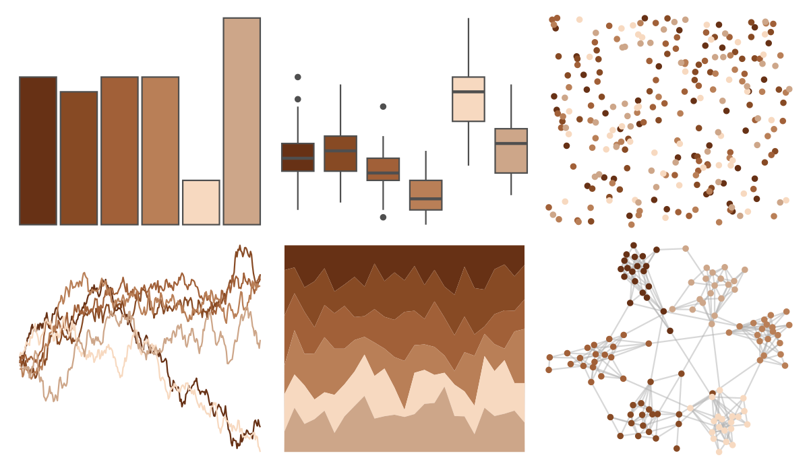

# Rdune - arrakis 

::: columns
::: {.column width="50%"}

**Github**

[nvietto/Rdune](https://github.com/nvietto/Rdune)
:::

::: {.column width="50%"}

**CRAN**

[Rdune](https://CRAN.R-project.org/package=Rdune)
:::
:::

<hr> 

Use with [paletteer](https://emilhvitfeldt.github.io/paletteer/) package:

```r
library(paletteer)
paletteer_d("Rdune::arrakis")
```

Use raw:

```r
c("#673115FF", "#874A24FF", "#A16038FF", "#B97F57FF", "#F7D9C0FF", "#CDA689FF")
``` 

 

<br>

# Related Palettes

<div class="list" style="display: grid; grid-template-columns: auto auto auto;"> <figure class="figure">
<a href="../../amerika/Dem_Ind_Rep3/"> </a>
</figure> <figure class="figure">
<a href="../../lisa/JohannJacobUlrich/"> </a>
</figure> <figure class="figure">
<a href="../../MetBrewer/OKeeffe2/"> </a>
</figure> <figure class="figure">
<a href="../../ButterflyColors/hylephila_phyleus/"> </a>
</figure> <figure class="figure">
<a href="../../colRoz/v_acanthurus/"> </a>
</figure> <figure class="figure">
<a href="../../vangogh/Shoes/"> </a>
</figure> <figure class="figure">
<a href="../../ButterflyColors/danaus_gilippus/"> </a>
</figure> <figure class="figure">
<a href="../../beyonce/X69/"> </a>
</figure> <figure class="figure">
<a href="../../Redmonder/qMSOYlOr/"> </a>
</figure> <figure class="figure">
<a href="../../fishualize/Zapteryx_brevirostris/"> </a>
</figure> <figure class="figure">
<a href="../../calecopal/dudleya/"> </a>
</figure> <figure class="figure">
<a href="../../ggthemes/excel_Red/"> </a>
</figure> 
</div>
