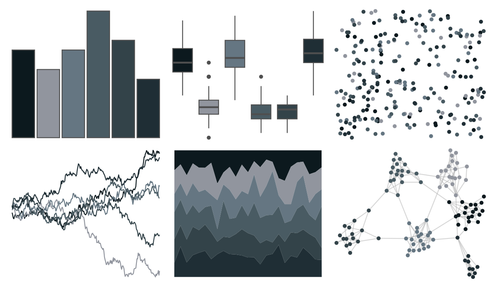

# Rdune - atreides 

::: columns
::: {.column width="50%"}

**Github**

[nvietto/Rdune](https://github.com/nvietto/Rdune)
:::

::: {.column width="50%"}

**CRAN**

[Rdune](https://CRAN.R-project.org/package=Rdune)
:::
:::

<hr> 

Use with [paletteer](https://emilhvitfeldt.github.io/paletteer/) package:

```r
library(paletteer)
paletteer_d("Rdune::atreides")
```

Use raw:

```r
c("#0C191EFF", "#91959EFF", "#657682FF", "#495B63FF", "#334349FF", "#1F2E35FF")
``` 

 

<br>

# Related Palettes

<div class="list" style="display: grid; grid-template-columns: auto auto auto;"> <figure class="figure">
<a href="../../amerika/Dem_Ind_Rep3/"> </a>
</figure> <figure class="figure">
<a href="../../NatParksPalettes/Yosemite/"> </a>
</figure> <figure class="figure">
<a href="../../musculusColors/ErHead/"> </a>
</figure> <figure class="figure">
<a href="../../beyonce/X84/"> </a>
</figure> <figure class="figure">
<a href="../../MetBrewer/Pillement/"> </a>
</figure> <figure class="figure">
<a href="../../ghibli/SpiritedDark/"> </a>
</figure> <figure class="figure">
<a href="../../ghibli/LaputaDark/"> </a>
</figure> <figure class="figure">
<a href="../../Rdune/atreides3/"> </a>
</figure> <figure class="figure">
<a href="../../yarrr/eternal/"> </a>
</figure> <figure class="figure">
<a href="../../colRoz/c_azureus/"> </a>
</figure> <figure class="figure">
<a href="../../unikn/pal_karpfenblau/"> </a>
</figure> <figure class="figure">
<a href="../../Manu/Kereru/"> </a>
</figure> 
</div>
