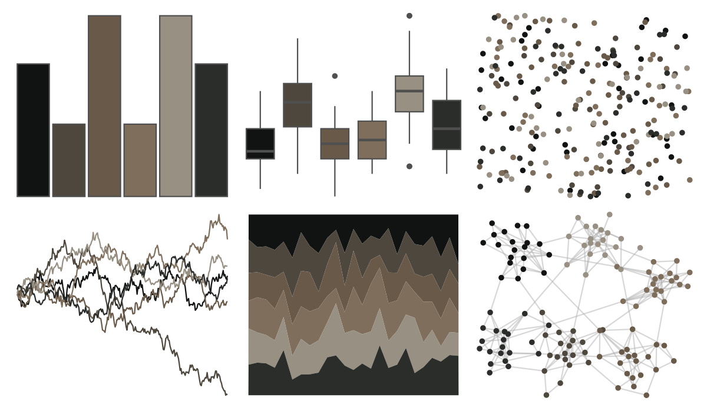

# Rdune - atreides2 

::: columns
::: {.column width="50%"}

**Github**

[nvietto/Rdune](https://github.com/nvietto/Rdune)
:::

::: {.column width="50%"}

**CRAN**

[Rdune](https://CRAN.R-project.org/package=Rdune)
:::
:::

<hr> 

Use with [paletteer](https://emilhvitfeldt.github.io/paletteer/) package:

```r
library(paletteer)
paletteer_d("Rdune::atreides2")
```

Use raw:

```r
c("#101311FF", "#4E473DFF", "#695948FF", "#7F6E5BFF", "#979083FF", "#2A2D29FF")
``` 

 

<br>

# Related Palettes

<div class="list" style="display: grid; grid-template-columns: auto auto auto;"> <figure class="figure">
<a href="../../amerika/Dem_Ind_Rep3/"> </a>
</figure> <figure class="figure">
<a href="../../Rdune/bene_gesserit/"> </a>
</figure> <figure class="figure">
<a href="../../MexBrewer/Taurus2/"> </a>
</figure> <figure class="figure">
<a href="../../ButterflyColors/philaethria_dido/"> </a>
</figure> <figure class="figure">
<a href="../../lisa/DiegoVelazquez/"> </a>
</figure> <figure class="figure">
<a href="../../beyonce/X103/"> </a>
</figure> <figure class="figure">
<a href="../../ghibli/TotoroMedium/"> </a>
</figure> <figure class="figure">
<a href="../../colRoz/v_viatica/"> </a>
</figure> <figure class="figure">
<a href="../../colRoz/thylacine/"> </a>
</figure> <figure class="figure">
<a href="../../colRoz/d_novae/"> </a>
</figure> <figure class="figure">
<a href="../../colRoz/kimberley/"> </a>
</figure> <figure class="figure">
<a href="../../beyonce/X42/"> </a>
</figure> 
</div>
