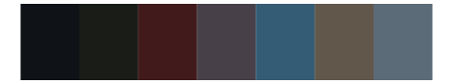

# Rdune - atreides3 

::: columns
::: {.column width="50%"}

**Github**

[nvietto/Rdune](https://github.com/nvietto/Rdune)
:::

::: {.column width="50%"}

**CRAN**

[Rdune](https://CRAN.R-project.org/package=Rdune)
:::
:::

<hr> 

Use with [paletteer](https://emilhvitfeldt.github.io/paletteer/) package:

```r
library(paletteer)
paletteer_d("Rdune::atreides3")
```

Use raw:

```r
c("#6B707CFF", "#575E6AFF", "#4F5660FF", "#414F5DFF", "#394652FF", "#313D48FF")
``` 

 

<br>

# Related Palettes

<div class="list" style="display: grid; grid-template-columns: auto auto auto;"> <figure class="figure">
<a href="../../amerika/Dem_Ind_Rep3/"> </a>
</figure> <figure class="figure">
<a href="../../nord/polarnight/"> </a>
</figure> <figure class="figure">
<a href="../../Rdune/harkonnen/"> </a>
</figure> <figure class="figure">
<a href="../../Rdune/atreides/"> </a>
</figure> <figure class="figure">
<a href="../../NatParksPalettes/Yosemite/"> </a>
</figure> <figure class="figure">
<a href="../../ghibli/SpiritedDark/"> </a>
</figure> <figure class="figure">
<a href="../../ButterflyColors/hemiargus_hanno/"> </a>
</figure> <figure class="figure">
<a href="../../unikn/pal_karpfenblau/"> </a>
</figure> <figure class="figure">
<a href="../../ghibli/LaputaDark/"> </a>
</figure> <figure class="figure">
<a href="../../ghibli/PonyoDark/"> </a>
</figure> <figure class="figure">
<a href="../../musculusColors/ErMole/"> </a>
</figure> <figure class="figure">
<a href="../../Rdune/harkonnen2/"> </a>
</figure> 
</div>
