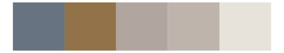

# Rdune - atreides4 

::: columns
::: {.column width="50%"}

**Github**

[nvietto/Rdune](https://github.com/nvietto/Rdune)
:::

::: {.column width="50%"}

**CRAN**

[Rdune](https://CRAN.R-project.org/package=Rdune)
:::
:::

<hr> 

Use with [paletteer](https://emilhvitfeldt.github.io/paletteer/) package:

```r
library(paletteer)
paletteer_d("Rdune::atreides4")
```

Use raw:

```r
c("#D6DEE5FF", "#CBC4C7FF", "#A19EADFF", "#978992FF", "#95858DFF", "#957770FF")
``` 

 

<br>

# Related Palettes

<div class="list" style="display: grid; grid-template-columns: auto auto auto;"> <figure class="figure">
<a href="../../amerika/Dem_Ind_Rep3/"> </a>
</figure> <figure class="figure">
<a href="../../musculusColors/ErFluke/"> </a>
</figure> <figure class="figure">
<a href="../../beyonce/X50/"> </a>
</figure> <figure class="figure">
<a href="../../ghibli/TotoroLight/"> </a>
</figure> <figure class="figure">
<a href="../../ghibli/KikiLight/"> </a>
</figure> <figure class="figure">
<a href="../../ggthemes/excel_Grayscale/"> </a>
</figure> <figure class="figure">
<a href="../../fishualize/Ginglymostoma_cirratum/"> </a>
</figure> <figure class="figure">
<a href="../../fishualize/Atherinella_brasiliensis/"> </a>
</figure> <figure class="figure">
<a href="../../ggthemes/Seattle_Grays/"> </a>
</figure> <figure class="figure">
<a href="../../palettetown/onix/"> </a>
</figure> <figure class="figure">
<a href="../../unikn/pal_grau/"> </a>
</figure> <figure class="figure">
<a href="../../calecopal/collinsia/"> </a>
</figure> 
</div>
