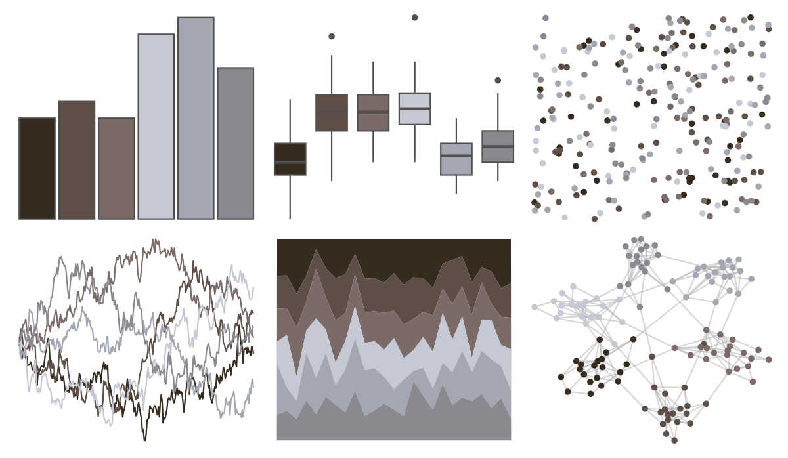

# Rdune - corrino 

::: columns
::: {.column width="50%"}

**Github**

[nvietto/Rdune](https://github.com/nvietto/Rdune)
:::

::: {.column width="50%"}

**CRAN**

[Rdune](https://CRAN.R-project.org/package=Rdune)
:::
:::

<hr> 

Use with [paletteer](https://emilhvitfeldt.github.io/paletteer/) package:

```r
library(paletteer)
paletteer_d("Rdune::corrino")
```

Use raw:

```r
c("#362B1FFF", "#5D4E46FF", "#7A6B68FF", "#C6C8D3FF", "#A4A6B1FF", "#8B898FFF")
``` 

 

<br>

# Related Palettes

<div class="list" style="display: grid; grid-template-columns: auto auto auto;"> <figure class="figure">
<a href="../../amerika/Dem_Ind_Rep3/"> </a>
</figure> <figure class="figure">
<a href="../../Manu/Kiwi/"> </a>
</figure> <figure class="figure">
<a href="../../calecopal/calochortus/"> </a>
</figure> <figure class="figure">
<a href="../../awtools/gpalette/"> </a>
</figure> <figure class="figure">
<a href="../../trekcolors/borg/"> </a>
</figure> <figure class="figure">
<a href="../../ggsci/brown_material/"> </a>
</figure> <figure class="figure">
<a href="../../NatParksPalettes/CapitolReef/"> </a>
</figure> <figure class="figure">
<a href="../../PrettyCols/Greys/"> </a>
</figure> <figure class="figure">
<a href="../../nord/halifax_harbor/"> </a>
</figure> <figure class="figure">
<a href="../../fishualize/Semicossyphus_pulcher/"> </a>
</figure> <figure class="figure">
<a href="../../beyonce/X3/"> </a>
</figure> <figure class="figure">
<a href="../../IslamicArt/fes2/"> </a>
</figure> 
</div>
