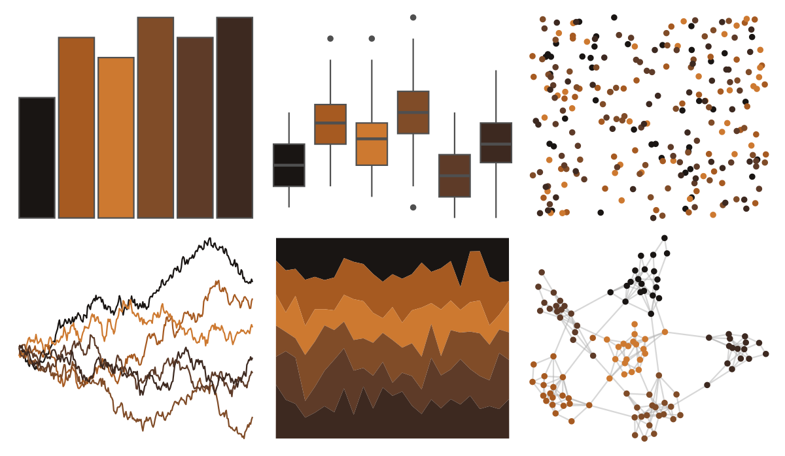

# Rdune - fermen2 

::: columns
::: {.column width="50%"}

**Github**

[nvietto/Rdune](https://github.com/nvietto/Rdune)
:::

::: {.column width="50%"}

**CRAN**

[Rdune](https://CRAN.R-project.org/package=Rdune)
:::
:::

<hr> 

Use with [paletteer](https://emilhvitfeldt.github.io/paletteer/) package:

```r
library(paletteer)
paletteer_d("Rdune::fermen2")
```

Use raw:

```r
c("#191513FF", "#A65A21FF", "#CD7930FF", "#804C28FF", "#5E3B28FF", "#3D2920FF")
``` 

 

<br>

# Related Palettes

<div class="list" style="display: grid; grid-template-columns: auto auto auto;"> <figure class="figure">
<a href="../../amerika/Dem_Ind_Rep3/"> </a>
</figure> <figure class="figure">
<a href="../../ButterflyColors/battus_polydamas/"> </a>
</figure> <figure class="figure">
<a href="../../beyonce/X42/"> </a>
</figure> <figure class="figure">
<a href="../../beyonce/X102/"> </a>
</figure> <figure class="figure">
<a href="../../Rdune/maythyknifechipandshatter/"> </a>
</figure> <figure class="figure">
<a href="../../lisa/AmedeoModigliani/"> </a>
</figure> <figure class="figure">
<a href="../../beyonce/X20/"> </a>
</figure> <figure class="figure">
<a href="../../NineteenEightyR/sunset2/"> </a>
</figure> <figure class="figure">
<a href="../../beyonce/X8/"> </a>
</figure> <figure class="figure">
<a href="../../MetBrewer/Wissing/"> </a>
</figure> <figure class="figure">
<a href="../../fishualize/Labrisomus_cricota/"> </a>
</figure> <figure class="figure">
<a href="../../MetBrewer/Gauguin/"> </a>
</figure> 
</div>
